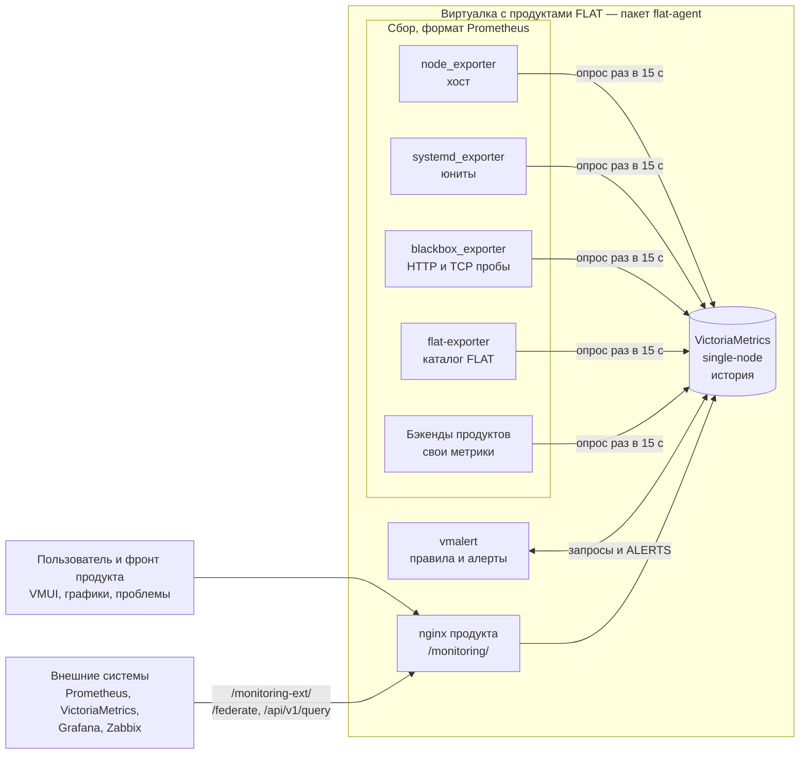

# flat_agent — локальный мини-мониторинг FLAT

`flat_agent` — самодостаточный мониторинг, который ставится **одним пакетом** на
каждую виртуалку с продуктами FLAT. Логика — как у MikroTik: данные можно
смотреть **локально** (графики с историей, список проблем) и забирать **снаружи**
по стандартам Prometheus (Prometheus, VictoriaMetrics, Grafana, Zabbix).

Своё с нуля не пишем: берём готовые open-source компоненты экосистемы
Prometheus и VictoriaMetrics, настраиваем их и добавляем только тонкий
`flat-exporter` для проверок, специфичных для FLAT.

> Это проектная документация. По ней переделывается фронт продуктов,
> в том числе работа с алертами. Архитектура проверена прототипом
> (2026-09-25), см. [«Статус»](#статус).

## Как это устроено

- **Сбор.** Экспортеры отдают метрики в формате Prometheus на `127.0.0.1`.
  VictoriaMetrics сама их опрашивает (`-promscrape.config`).
- **История.** VictoriaMetrics single-node хранит данные на диске
  виртуалки (по умолчанию 30 дней).
- **Просмотр.** Встроенный VMUI с нашими дашбордами и фронт продукта
  через API, совместимый с Prometheus.
- **Проблемы.** vmalert считает правила (бывшие `issues[]`) и отдаёт
  текущие алерты через API. Alertmanager — отдельное решение, пока не принято.
- **Наружу.** Только через nginx продукта: люди и фронт — `/monitoring/` по
  сессии продукта, внешние системы — `/monitoring-ext/` по токену и списку
  адресов, только чтение: `/federate` (текущие значения) и API запросов
  (история).

## Состав

| Компонент | Роль | Порт (только 127.0.0.1) | Лицензия |
|---|---|---|---|
| VictoriaMetrics single-node | сбор, хранение, API, VMUI, `/federate` | 8428 | Apache-2.0 |
| vmalert | правила и алерты | 8880 | Apache-2.0 |
| node_exporter | метрики хоста | 9100 | Apache-2.0 |
| systemd_exporter | состояние и ресурсы юнитов | 9558 | Apache-2.0 |
| blackbox_exporter | HTTP-health и TCP-порты | 9115 | Apache-2.0 |
| flat-exporter (наш) | каталог FLAT: пакеты, версии, каталоги, конфиги | 8430 (план) | наша |
| vmagent (по желанию) | отправка наружу с буфером на диске | 8429 | Apache-2.0 |

Все бинарники собираются из исходников статически: Go и библиотеки на
целевой машине не нужны. Подробности — [сборка и пакет](docs/06-packaging.md).

## Документация

| Документ | О чём | Кому |
|---|---|---|
| [01 — Архитектура](docs/01-architecture.md) | компоненты, потоки данных, конфигурация, модель «плагинов» продуктов, доступ, ресурсы | всем |
| [02 — Метрики](docs/02-metrics.md) | контракт метрик и меток, соответствие старому JSON, запросы для экранов | **фронт** |
| [03 — Алерты](docs/03-alerts.md) | контракт алертов, каталог правил, как фронт получает проблемы, варианты Alertmanager | **фронт** |
| [04 — API для фронта](docs/04-frontend-api.md) | эндпоинты, параметры, реальные ответы, VMUI, задержки, ошибки | **фронт** |
| [05 — Внешние системы](docs/05-integrations.md) | Prometheus, центральная VictoriaMetrics, Grafana, Zabbix, выгрузка истории | эксплуатация |
| [06 — Сборка и пакет](docs/06-packaging.md) | один deb/rpm, версии, сборка из исходников, systemd, особенности ОС | сборка |
| [07 — Лицензии](docs/07-licenses.md) | лицензии компонентов и зависимостей, обязанности, РФ | юристы, сборка |

## Ключевые решения

1. **Ядро — VictoriaMetrics single-node.** Одна программа собирает, хранит,
   отдаёт API и UI. Её хранилище собственное, но все входы и выходы совместимы
   с Prometheus.
2. **Внутри виртуалки — pull.** VictoriaMetrics опрашивает экспортеры; наружу
   данные отдаются по запросу (`/federate`, API). Отправка в центр
   (vmagent) — по желанию.
3. **Всё слушает только 127.0.0.1.** Снаружи доступ только через nginx продукта
   с его авторизацией.
4. **Продукты подключаются файлами.** Каждый продукт кладёт свои правила сбора,
   дашборды и алерты в каталоги `/etc/flat-agent/*.d/`; ядро о продуктах
   ничего не знает.
5. **Проблемы — это правила vmalert**, а не данные агента. Коды совпадают со
   старыми `issues[].code`.
6. **Один пакет deb/rpm**, собранный из исходников, без обращений в интернет
   во время работы.

## Статус

Проверено на прототипе (2026-09-25, Go 1.27.1):

- сборка всех компонентов из исходников в статические бинарники;
- сбор метрик VictoriaMetrics, история, VMUI с нашим дашбордом из JSON;
- правила vmalert: алерт `pending` → `firing`, ряды `ALERTS` в базе,
  API алертов через VictoriaMetrics, работа под префиксом `/monitoring`;
- `blackbox_exporter`: health-проверка HTTP и проверка TCP-порта;
- `/federate` и API запросов, доступ через nginx с сессией и с токеном;
- сборка из тегов релизов и пакет deb/rpm со всеми компонентами (38 МБ):
  установка, обновление и удаление в Ubuntu 24.04, юниты проходят
  `systemd-analyze verify`, `flat-agent-check` находит ошибки конфигурации;
- лицензии модулей Go (`go-licenses`) и JS-библиотек встроенного VMUI.

Не проверено или не сделано:

- `flat-exporter` — только контракт метрик; на первом этапе его заменяет
  файл для textfile-коллектора `node_exporter`;
- работа юнитов под запущенным systemd, в том числе `systemd_exporter`
  (в песочнице systemd не запущен);
- установка rpm, сборка пакета в CI, установка на Astra Linux, РЕД ОС, ALT;
- решение по Alertmanager и отправке данных в центр.

## Открытые вопросы

1. Сколько RAM и диска можно отдать мониторингу на виртуалке и сколько хранить
   историю (по умолчанию в документах — 256 МБ кешей VictoriaMetrics и 30 дней).
2. Авторизация: какой механизм сессий у фронтов продуктов (под него пишется
   `auth_request` в nginx).
3. Alertmanager: не нужен, локальный или центральный
   (см. [03 — Алерты](docs/03-alerts.md#alertmanager-варианты)).
4. Нужна ли отправка в центр «из коробки» или внешним системам достаточно
   забирать данные самим.

## Связь с `agent/flat_check_agent.sh`

`flat_check_agent.sh` собирает снимок хоста и шлёт его JSON-ом на бэкенды.
`flat_agent` заменяет эту модель: данные хранятся локально с историей и
отдаются по стандартам Prometheus. Соответствие полей старого JSON новым
метрикам и запросам — в [02 — Метрики](docs/02-metrics.md#соответствие-старому-json).
