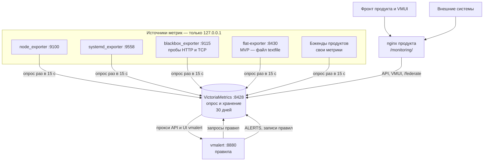
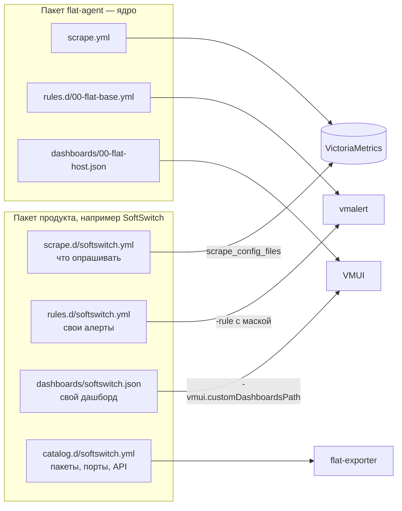
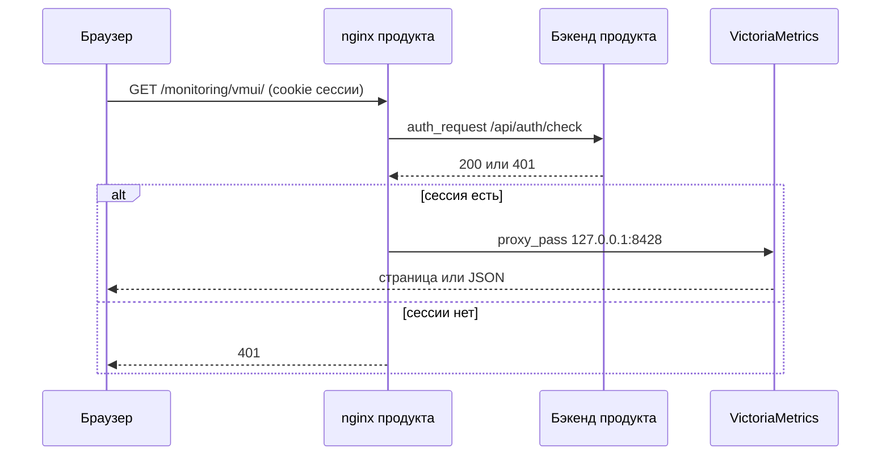
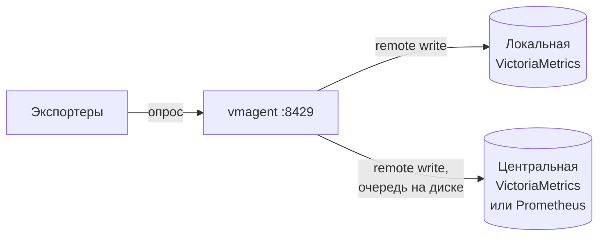

# 01 — Архитектура flat_agent

[← к оглавлению](../README.md)

## Принципы

1. **Самодостаточность.** Всё работает на виртуалке без центрального сервера и
   без интернета: сбор, хранение истории, графики, проблемы.
2. **Стандарты Prometheus на входе и выходе.** Формат метрик, язык запросов
   (PromQL, в VictoriaMetrics — совместимый MetricsQL), `/federate`, remote write.
3. **Готовые компоненты вместо своего кода.** Свой код — только `flat-exporter`
   для проверок, которых нет в готовых экспортерах.
4. **Всё слушает только `127.0.0.1`.** Снаружи — только через nginx продукта.
5. **Продукты подключаются файлами.** Ядро не знает о продуктах; каждый продукт
   кладёт свои задания сбора, дашборды и правила в каталоги `*.d/`.

## Компоненты

| Компонент | Что делает | Адрес | Конфигурация | Данные | systemd-юнит |
|---|---|---|---|---|---|
| VictoriaMetrics single-node | опрашивает экспортеры, хранит историю, отдаёт API, VMUI, `/federate`, проксирует API vmalert | `127.0.0.1:8428`, префикс `/monitoring` | `/etc/flat-agent/scrape.yml`, `scrape.d/`, `dashboards/` | `/var/lib/flat-agent/vm` | `flat-agent-vm.service` |
| vmalert | считает правила, хранит состояние алертов в VictoriaMetrics | `127.0.0.1:8880` | `/etc/flat-agent/rules.d/*.yml` | — (состояние в VictoriaMetrics) | `flat-agent-vmalert.service` |
| node_exporter | метрики хоста: CPU, память, диски, сеть, загрузка; textfile-коллектор | `127.0.0.1:9100` | флаги | `/var/lib/flat-agent/textfile` | `flat-agent-node-exporter.service` |
| systemd_exporter | состояние, время старта, CPU, число задач юнитов | `127.0.0.1:9558` | флаги | — | `flat-agent-systemd-exporter.service` |
| blackbox_exporter | HTTP-health API и TCP-порты по списку | `127.0.0.1:9115` | `/etc/flat-agent/blackbox.yml` | — | `flat-agent-blackbox.service` |
| flat-exporter (наш, план) | каталог FLAT: пакеты и версии, enabled, unit-файлы, каталоги, конфиги, UDP-порты, память сервисов, файлы сертификатов | `127.0.0.1:8430` | `/etc/flat-agent/catalog.d/*.yml` | — | `flat-agent-exporter.service` |
| vmagent (по желанию) | отправка данных наружу с очередью на диске | `127.0.0.1:8429` | флаги | `/var/lib/flat-agent/vmagent` | `flat-agent-vmagent.service` |

Все юниты объединены целью `flat-agent.target`: один сервис с точки зрения
администратора. Подробности — [06 — Сборка и пакет](06-packaging.md#systemd).

## Потоки данных



## Сбор метрик

VictoriaMetrics сама опрашивает экспортеры по файлу в формате `prometheus.yml`
(`-promscrape.config`). Отдельный Prometheus или vmagent для этого не нужен.

Базовая конфигурация (ставится пакетом; проверена `victoria-metrics -dryRun`
и на прототипе):

```yaml
# /etc/flat-agent/scrape.yml — базовая конфигурация сбора (ставится пакетом flat-agent).
# Продукты добавляют свои задания файлами в /etc/flat-agent/scrape.d/*.yml.
global:
  scrape_interval: 15s
  scrape_timeout: 10s
  external_labels:
    host: "%{FLAT_HOST}"          # имя виртуалки из /etc/flat-agent/flat-agent.env

scrape_config_files:
  - /etc/flat-agent/scrape.d/*.yml

scrape_configs:
  - job_name: node
    static_configs:
      - targets: ["127.0.0.1:9100"]

  - job_name: systemd
    static_configs:
      - targets: ["127.0.0.1:9558"]

  # После появления flat-exporter; до этого его метрики идут через textfile node_exporter.
  # - job_name: flat-exporter
  #   static_configs:
  #     - targets: ["127.0.0.1:8430"]

  - job_name: flat-agent-vm        # самомониторинг VictoriaMetrics, только нужные ряды
    metrics_path: /monitoring/metrics
    static_configs:
      - targets: ["127.0.0.1:8428"]
    metric_relabel_configs:
      - source_labels: [__name__]
        regex: "vm_app_version|vm_free_disk_space_bytes|vm_free_disk_space_limit_bytes|vm_storage_is_read_only|vm_data_size_bytes|vm_rows_added_to_storage_total|process_resident_memory_bytes|process_cpu_seconds_total"
        action: keep

  - job_name: flat-agent-vmalert   # самомониторинг vmalert, только нужные ряды
    static_configs:
      - targets: ["127.0.0.1:8880"]
    metric_relabel_configs:
      - source_labels: [__name__]
        regex: "vmalert_alerts_firing|vmalert_alerts_pending|vmalert_alerting_rules_errors_total|vmalert_recording_rules_errors_total|vmalert_config_last_reload_successful|vmalert_iteration_missed_total|process_resident_memory_bytes|process_cpu_seconds_total"
        action: keep
```

Пояснения:

- **`scrape_interval: 15s`** — один интервал на всё. От него зависят окна
  в запросах: для `rate()` берём `[1m]` (не меньше четырёх интервалов).
- **`external_labels.host`** добавляется ко **всем** собранным рядам. Без неё
  данные разных виртуалок во внешней системе смешаются. `%{FLAT_HOST}` —
  подстановка переменной окружения, её делает сама VictoriaMetrics.
- **Самомониторинг выборочный.** Полный `/metrics` VictoriaMetrics — около
  1 240 рядов, больше, чем метрики самого хоста. Флаг `-selfScrapeInterval`
  не используем, собираем отдельным заданием с белым списком (21 ряд вместо
  1 240 на прототипе).
- **Метки продукта.** `product` и `package` добавляют задания из
  `scrape.d/` продукта (см. ниже). На них строятся экраны и правила.

## Хранение: VictoriaMetrics single-node

Флаги запуска (проверены на прототипе):

```text
/opt/flat/flat-agent/bin/victoria-metrics \
  -httpListenAddr=127.0.0.1:8428 \
  -http.pathPrefix=/monitoring \
  -http.disableCORS \
  -storageDataPath=/var/lib/flat-agent/vm \
  -retentionPeriod=${FLAT_RETENTION} \
  -storage.minFreeDiskSpaceBytes=${FLAT_MIN_FREE_DISK} \
  -memory.allowedBytes=${FLAT_VM_MEMORY} \
  -disablePerDayIndex \
  -promscrape.config=/etc/flat-agent/scrape.yml \
  -promscrape.configCheckInterval=30s \
  -vmui.customDashboardsPath=/etc/flat-agent/dashboards \
  -vmalert.proxyURL=http://127.0.0.1:8880 \
  -search.latencyOffset=10s
```

| Флаг | Значение | Зачем |
|---|---|---|
| `-httpListenAddr` | `127.0.0.1:8428` | только локально; снаружи — через nginx |
| `-http.pathPrefix` | `/monitoring` | все пути под `/monitoring/…`, чтобы nginx проксировал без переписывания URL |
| `-http.disableCORS` | — | по умолчанию VictoriaMetrics отвечает `Access-Control-Allow-Origin: *`; фронт ходит с того же домена через nginx, CORS не нужен |
| `-retentionPeriod` | `30d` (`FLAT_RETENTION`) | срок хранения; удаление — помесячными разделами, реальный объём до «срок + 1 месяц» |
| `-storage.minFreeDiskSpaceBytes` | `1GB` (`FLAT_MIN_FREE_DISK`) | при меньшем свободном месте база перестаёт принимать данные и не забивает диск продукту |
| `-memory.allowedBytes` | `256MiB` (`FLAT_VM_MEMORY`) | предел кешей; по умолчанию 60 % памяти машины — на виртуалке продукта это недопустимо |
| `-disablePerDayIndex` | — | у нас мало рядов и они стабильны; меньше диска и CPU. Включать только на новой установке: обратно включить без потери поиска по старым данным нельзя |
| `-promscrape.configCheckInterval` | `30s` | подхватывать новые файлы продуктов без перезапуска |
| `-vmui.customDashboardsPath` | каталог | наши дашборды во вкладке Dashboards VMUI |
| `-vmalert.proxyURL` | `http://127.0.0.1:8880` | API алертов и UI vmalert доступны через тот же адрес `/monitoring/` |
| `-search.latencyOffset` | `10s` | насколько «назад» от текущего момента показываются данные (по умолчанию 30 с) |

Ограничение: предела по **размеру** базы нет, только по сроку и по свободному
месту. Срок хранения выбираем по оценке объёма (см. [«Ресурсы»](#ресурсы)).

## Правила и алерты: vmalert

```text
/opt/flat/flat-agent/bin/vmalert \
  -httpListenAddr=127.0.0.1:8880 \
  -rule="/etc/flat-agent/rules.d/*.yml" \
  -configCheckInterval=30s \
  -datasource.url=http://127.0.0.1:8428/monitoring \
  -remoteWrite.url=http://127.0.0.1:8428/monitoring \
  -remoteRead.url=http://127.0.0.1:8428/monitoring \
  -evaluationInterval=15s \
  -rule.evalDelay=10s \
  -external.url=https://${FLAT_EXTERNAL_HOST}/monitoring \
  -notifier.blackhole
```

- `-remoteWrite.url` — состояние алертов записывается в базу рядами `ALERTS` и
  `ALERTS_FOR_STATE`: история проблем и восстановление после перезапуска
  (`-remoteRead.url`). Без этого флага vmalert не запустится, если в правилах
  есть производные ряды (`record:`).
- `-rule.evalDelay` **должен совпадать** с `-search.latencyOffset`.
  Иначе правила смотрят на данные, которых база ещё не показывает.
- `-notifier.blackhole` — уведомления никуда не отправляются, пока не принято
  решение по Alertmanager. Алерты видны через API.
- `-external.url` — внешний адрес для ссылок на алерт (`source`,
  `generatorURL`). vmalert сам добавляет к нему `/vmalert/alert?…`, поэтому
  указывается адрес до `/monitoring` включительно (проверено: ссылка
  открывается через nginx и прокси VictoriaMetrics).

Контракт алертов, каталог правил и API — в [03 — Алерты](03-alerts.md).

## Модель «плагинов» продуктов



Что кладёт пакет продукта:

| Файл | Кто читает | Когда подхватывается |
|---|---|---|
| `/etc/flat-agent/scrape.d/<продукт>.yml` | VictoriaMetrics (`scrape_config_files`) | каждые 30 с (`-promscrape.configCheckInterval`) |
| `/etc/flat-agent/rules.d/<продукт>.yml` | vmalert (`-rule` с маской) | каждые 30 с (`-configCheckInterval`) |
| `/etc/flat-agent/dashboards/<продукт>.json` | VMUI | при открытии страницы |
| `/etc/flat-agent/catalog.d/<продукт>.yml` | flat-exporter | по `SIGHUP` или таймеру (при реализации) |

Поставили продукт — появились его графики, проверки и алерты. Удалили — пропали.

### Соглашения для файлов продуктов

- **`job_name` уникален на всю виртуалку.** Одинаковые имена в разных файлах
  VictoriaMetrics не принимает: при старте это фатальная ошибка (мониторинг не
  поднимется), на ходу база продолжает работать со старой конфигурацией и
  пишет ошибку в лог (проверено). Формат имени: `<продукт>-<проверка>`,
  например `softswitch-api`.
- **Обязательные метки** в `static_configs.labels`:
  - `check` — вид проверки: `api` (HTTP health), `port` (TCP-порт),
    `app` (собственные метрики бэкенда);
  - `product` — продукт, как в каталоге (`SoftSwitch`);
  - `package` — пакет (`fss-backend`);
  - `port` — для `check: port`.

  На этих метках построены базовые правила и экраны фронта; имена заданий
  в правилах не используются.
- **Проверка перед установкой.** `postinst` продукта проверяет итоговую
  конфигурацию и только потом кладёт файл на место
  (см. [06 — Сборка и пакет](06-packaging.md#проверка-конфигурации)):

  ```sh
  /opt/flat/flat-agent/bin/victoria-metrics -promscrape.config=/etc/flat-agent/scrape.yml -dryRun
  /opt/flat/flat-agent/bin/vmalert -rule="/etc/flat-agent/rules.d/*.yml" -dryRun
  ```

### Пример: `scrape.d/softswitch.yml`

Проверено на прототипе (health-проверка и TCP-порт через `blackbox_exporter`):

```yaml
# /etc/flat-agent/scrape.d/softswitch.yml — кладёт пакет SoftSwitch.
# job_name уникален на всю виртуалку: <продукт>-<проверка>.
# Метки check/product/package обязательны: на них построены правила и экраны.

# HTTP health-проверки API пакетов (blackbox_exporter, модуль http_2xx).
- job_name: softswitch-api
  metrics_path: /probe
  params:
    module: [http_2xx]
  static_configs:
    - targets: ["http://127.0.0.1:8082/api/health"]
      labels: {check: "api", product: "SoftSwitch", package: "fss-backend"}
    - targets: ["http://127.0.0.1:8080/api/v1/health"]
      labels: {check: "api", product: "SoftSwitch", package: "fss-server"}
  relabel_configs:
    - source_labels: [__address__]
      target_label: __param_target
    - source_labels: [__param_target]
      target_label: instance
    - target_label: __address__
      replacement: 127.0.0.1:9115

# TCP-порты, которые должны слушаться (blackbox_exporter, модуль tcp_connect).
- job_name: softswitch-port
  metrics_path: /probe
  params:
    module: [tcp_connect]
  static_configs:
    - targets: ["127.0.0.1:8082"]
      labels: {check: "port", product: "SoftSwitch", package: "fss-backend", port: "8082"}
    - targets: ["127.0.0.1:8080"]
      labels: {check: "port", product: "SoftSwitch", package: "fss-server", port: "8080"}
  relabel_configs:
    - source_labels: [__address__]
      target_label: __param_target
    - source_labels: [__param_target]
      target_label: instance
    - target_label: __address__
      replacement: 127.0.0.1:9115

# Собственные метрики бэкенда, когда он начнёт их отдавать.
# - job_name: softswitch-app
#   static_configs:
#     - targets: ["127.0.0.1:8082"]
#       labels: {check: "app", product: "SoftSwitch", package: "fss-backend"}
```

### Пример: `catalog.d/softswitch.yml` (проект формата)

Описание пакетов для `flat-exporter`. Заменяет общий
`flat_check.packages.conf`: каждый продукт описывает только себя.

```yaml
# /etc/flat-agent/catalog.d/softswitch.yml — проект формата, уточняется при реализации flat-exporter.
product: SoftSwitch
packages:
  - name: fss-backend
    legacy: [flatSoftSwitchBackend]    # старые имена пакета
    ports: ["8082/tcp"]
    api: "http://127.0.0.1:8082/api/health"
    depends: [postgresql]
  - name: fss-mediasrv
    legacy: [mediasrv]
    ports: ["5060/udp", "10000-20000/udp"]  # для диапазона проверяется первый порт, как сейчас
  - name: fss-frontend
    legacy: [softswitch-frontend]
    depends: [nginx]
```

## Доступ и безопасность

Все компоненты слушают только `127.0.0.1`. Люди, фронт и внешние системы
попадают к данным только через nginx продукта:



Два входа:

| Путь | Для кого | Доступ | Что открыто |
|---|---|---|---|
| `/monitoring/` | люди и фронт продукта | сессия продукта (`auth_request`) | всё для чтения: API, VMUI, UI vmalert, `/federate` |
| `/monitoring-ext/` | внешние системы: Prometheus, VictoriaMetrics, Grafana, Zabbix | токен и список адресов | только `federate` и API запросов, перечислены явно |

Конфигурация nginx (проверена на nginx 1.24: без сессии — 401, с сессией —
VMUI и запросы работают; запись, импорт, удаление рядов, снапшоты и служебные
эндпоинты — 403; `/monitoring-ext/` без токена — 401, с токеном открыты
только перечисленные пути):

```nginx
# /etc/nginx/conf.d/flat-agent-map.conf — уровень http {}.
# Токен для внешних систем мониторинга (Prometheus, VictoriaMetrics, Grafana, Zabbix).
map $http_authorization $flat_agent_ext_auth {
    default              0;
    "Bearer CHANGE_ME"   1;
}
```

```nginx
# /etc/nginx/snippets/flat-agent.conf — подключается в server {} фронта продукта.

# 1. Пишущие, служебные и опасные эндпоинты закрыты полностью.
location ~ ^/monitoring/((prometheus/)?api/v1/(admin|write|import)|snapshot|internal|debug|config|flags|write|influx|datadog|opentelemetry|newrelic|zabbixconnector|(vmalert/)?-/reload) {
    return 403;
}

# 2. Люди и фронт продукта: всё под /monitoring/ — по сессии продукта.
location /monitoring/ {
    auth_request /flat-agent-auth;
    proxy_pass http://127.0.0.1:8428;   # без URI: префикс /monitoring/ сохраняется
    proxy_set_header Host $host;
    proxy_read_timeout 60s;
}

# Проверка сессии делегируется бэкенду продукта: 2xx — пустить, 401/403 — нет.
location = /flat-agent-auth {
    internal;
    proxy_pass http://127.0.0.1:<порт бэкенда>/api/auth/check;
    proxy_pass_request_body off;
    proxy_set_header Content-Length "";
    proxy_set_header X-Original-URI $request_uri;
}

# 3. Внешние системы (Prometheus, VictoriaMetrics, Grafana, Zabbix): только чтение,
#    по токену и списку адресов. Разрешённые пути перечислены явно, остальное — 403.
location /monitoring-ext/ {
    allow 127.0.0.1;
    allow 10.0.0.0/8;              # адреса систем мониторинга заказчика
    deny  all;
    if ($flat_agent_ext_auth = 0) {
        return 401;
    }
    rewrite ^/monitoring-ext/(federate|api/v1/(query|query_range|series|labels|label/[^/]+/values|metadata|status/buildinfo))$ /monitoring/$1 break;
    return 403;
    proxy_pass http://127.0.0.1:8428;
}
```

Важно:

- **Удаление рядов принимает любой метод, включая GET**
  (`/api/v1/admin/tsdb/delete_series`). Поэтому пишущие и служебные пути
  закрыты в nginx явно, а не только ограничением методов.
- **VMUI шлёт запросы методом POST.** Запрещать POST целиком нельзя: сломаются
  графики.
- **`/monitoring-ext/` — список разрешённых путей.** `rewrite … break`
  пропускает только перечисленные пути, для остальных срабатывает `return 403`.
  API алертов, VMUI и UI vmalert снаружи закрыты; при необходимости их
  добавляют в выражение `rewrite`.
- Токен и список адресов — на каждой виртуалке свои, их задаёт администратор.
  Подробности подключения внешних систем — в
  [05 — Внешние системы](05-integrations.md).
- **Телеметрии нет.** Ни VictoriaMetrics, ни VMUI, ни экспортеры никуда сами
  не обращаются (проверено по исходникам). Подходит для закрытых контуров.
- Процессы работают от системного пользователя `flat-agent`, не от root.
  `systemd_exporter` читает состояние юнитов через D-Bus без root. На хостах
  с `hidepid=2` для `/proc` метрики процессов будут неполными.

## Файлы и каталоги на виртуалке

```text
/opt/flat/flat-agent/bin/          бинарники: victoria-metrics, vmalert, vmagent,
                                   node_exporter, systemd_exporter, blackbox_exporter,
                                   flat-exporter
/etc/flat-agent/flat-agent.env     общие настройки: FLAT_HOST, FLAT_RETENTION, FLAT_VM_MEMORY, …
/etc/flat-agent/scrape.yml         базовый сбор
/etc/flat-agent/scrape.d/          сбор от продуктов
/etc/flat-agent/rules.d/           правила алертов (база + продукты)
/etc/flat-agent/dashboards/        дашборды VMUI (база + продукты)
/etc/flat-agent/catalog.d/         каталог пакетов для flat-exporter
/etc/flat-agent/blackbox.yml       модули проб blackbox_exporter
/var/lib/flat-agent/vm/            база VictoriaMetrics
/var/lib/flat-agent/textfile/      файлы *.prom для textfile-коллектора (MVP flat-exporter)
/var/lib/flat-agent/vmagent/       очередь vmagent (если включён)
/lib/systemd/system/flat-agent*    target и юниты
/usr/share/doc/flat-agent/         лицензии, NOTICE, исходники MPL-2.0
```

Логи — в journald (`journalctl -u 'flat-agent*'`).

`/etc/flat-agent/flat-agent.env` (заполняет `postinst`, правит администратор):

```sh
# Метка host на всех рядах; по умолчанию hostname -s.
FLAT_HOST=ss-n1
# Срок хранения истории.
FLAT_RETENTION=30d
# Предел кешей VictoriaMetrics.
FLAT_VM_MEMORY=256MiB
# Если свободного места меньше, база перестаёт принимать данные.
FLAT_MIN_FREE_DISK=1GB
# Адрес для ссылок из алертов.
FLAT_EXTERNAL_HOST=ss-n1.example.local
# Какие юниты собирает systemd_exporter (регулярное выражение, см. 06).
FLAT_SYSTEMD_UNITS='.+[.]service'
```

Формат файла — как у `EnvironmentFile` в systemd: комментарии только
отдельной строкой. Комментарий в конце строки systemd считает частью
значения (проверено на systemd 255: `FLAT_HOST=ss-n1  # …` превращается
в `ss-n1  # …`). Значения со спецсимволами — в одинарных кавычках.

## Ресурсы

Замер на прототипе: 30 минут работы, опрос раз в 15 с, контейнер Ubuntu 24.04.

| | Значение |
|---|---|
| Память, VictoriaMetrics | 75 МБ (с `-memory.allowedPercent=5`; с `-memory.allowedBytes=256MiB` — не больше предела кешей плюс рабочая память) |
| Память, node_exporter | 23 МБ |
| Память, vmalert | 21 МБ |
| CPU на всех | около 0,9 % одного ядра |
| Рядов | ~760 с выборочным самомониторингом (~2 000 с полным) |
| Диск | ~1,1 байта на точку через 30 минут; величина уменьшается по мере фоновых слияний |

Оценка объёма: 760 рядов × 5 760 точек в сутки ≈ 4,4 млн точек ≈ 5 МБ в сутки ≈
150 МБ за 30 дней. Старые данные удаляются помесячными разделами, поэтому
в худшем случае на диске лежит «срок хранения + 1 месяц» — около 300 МБ при
`30d`. На реальной виртуалке рядов больше (диски, сетевые интерфейсы,
продукты), поэтому точную цифру даёт только суточный прогон, как рекомендует
документация VictoriaMetrics.

## Ограничения и компромиссы

| Ограничение | Что делаем |
|---|---|
| Нет предела по размеру базы | срок хранения по оценке объёма и `-storage.minFreeDiskSpaceBytes` |
| VictoriaMetrics сама не отправляет данные наружу | внешние системы забирают сами (`/federate`, API); для отправки — vmagent |
| При перезапуске «старые» ряды видны до 5 минут | для текущего состояния фронт передаёт `step=30s` или `step=1m` (см. [04](04-frontend-api.md#текущее-состояние-и-параметр-step)) |
| Данные видны с задержкой `-search.latencyOffset` | 10 с вместо 30 с по умолчанию; для правил та же задержка |
| systemd_exporter требует systemd и D-Bus | на всех целевых ОС это systemd; иначе коллектор не работает |
| Пока VictoriaMetrics перезапускается, метрики не собираются | в графиках пропуск на время перезапуска (секунды); перезапуск — только при обновлении пакета |
| Ошибка в файле продукта ломает загрузку всей конфигурации | `-dryRun` в `postinst` продукта до того, как файл попадёт на место |

## Развитие

### Отправка в центр (по желанию)

Если внешней системе удобнее принимать данные, а не забирать, включается
vmagent. Он берёт на себя опрос вместо VictoriaMetrics и пишет в два места —
локальную базу и центр — с отдельной очередью на диске для каждого адреса:



При этом у VictoriaMetrics убирается `-promscrape.config`, а тот же файл
передаётся vmagent. Подробности — [05 — Внешние системы](05-integrations.md#отправка-в-центр-vmagent).

### Один бинарник

Можно собрать свою сборку VictoriaMetrics со встроенными коллекторами: её
`main.go` около 220 строк, коллекторы подключаются через
`metrics.RegisterMetricsWriter`, и встроенный self-scrape пишет их прямо в
базу. Получается один процесс и один порт, но это свой форк, который нужно
переносить на каждую новую версию. Пока не планируется: для «одного пакета»
это не нужно.
