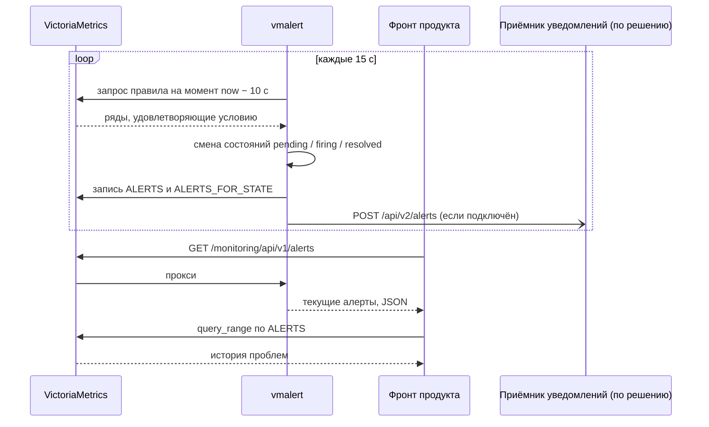
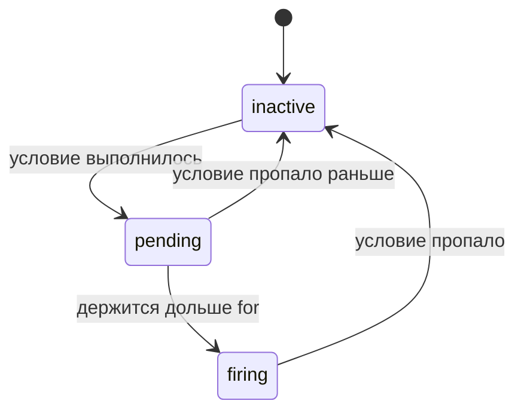

# 03 — Алерты: контракт для фронта

[← к оглавлению](../README.md)

«Проблемы» в flat_agent — это **правила vmalert**, а не данные агента.
Агент (экспортеры) отдаёт факты: «юнит не активен», «порт не слушается».
Правила решают, что из этого проблема и насколько серьёзная. Коды проблем
совпадают со старыми `issues[].code` из `flat_check_agent.sh`, поэтому фронт
может сохранить свою логику отображения.

Всё в документе проверено на прототипе: базовые правила загружены в vmalert
без ошибок, заложенные в тестовые данные проблемы сработали, ответы API —
реальные.

## Как это работает



### Состояния алерта



- **`pending`** — условие выполняется, но меньше, чем `for` правила. Это ещё не
  проблема; фронт может показывать такие алерты приглушённо или не показывать.
- **`firing`** — проблема. В `activeAt` — когда условие впервые выполнилось.
- Когда условие пропадает, алерт исчезает из API. Если подключён приёмник
  уведомлений, он получает сообщение с `endsAt` в прошлом.

## Контракт алерта

### Имя (`alertname`)

CamelCase с префиксом по области:

| Префикс | Область | Пример |
|---|---|---|
| `Flat` | пакеты и сервисы FLAT | `FlatUnitNotActive` |
| `Flat<Продукт>` | правила, которые поставляет продукт | `FlatSoftSwitchNoRegistrations` |
| `Host` | ресурсы виртуалки | `HostFilesystemFull` |
| `FlatAgent` | сам мониторинг | `FlatAgentStorageReadOnly` |

### Метки

| Метка | Обязательна | Значение |
|---|---|---|
| `severity` | да | `error` или `warning`; `info` — для отладки и тестов |
| `code` | да | машинный код проблемы; для старых проверок совпадает с `issues[].code` |
| `alertname` | да (ставит vmalert) | имя правила |
| `alertgroup` | да (ставит vmalert) | группа правил |
| `host` | да (из рядов) | виртуалка |
| `product`, `package` | для проблем пакетов | из рядов, по которым сработало правило |
| прочие | — | переходят из рядов: `unit`, `port`, `path`, `mountpoint`, `instance`, `job`, … |

Уровни важности:

| `severity` | Смысл | Примеры |
|---|---|---|
| `error` | не работает функция или скоро перестанет | сервис не запущен, не в автозапуске, база мониторинга не пишет, сертификат истекает через < 7 дней |
| `warning` | нужно внимание, но работает | API не отвечает на health-проверку, не слушается порт, нет каталога, диск заполнен на 85 % |
| `info` | для отладки | — |

Фронт не должен опираться на `job` и `instance` — они описывают способ сбора,
а не объект проблемы.

### Аннотации

| Аннотация | Обязательна | Назначение |
|---|---|---|
| `summary` | да | заголовок проблемы для UI, одна строка по-русски |
| `description` | желательно | подробности: какой путь, адрес, юнит |
| `runbook_url` | нет | ссылка на инструкцию «что делать» |

Шаблоны: `{{ $labels.<метка> }}` — значение метки, `{{ $value }}` — значение
выражения; функции `humanize`, `humanizePercentage`, `humanize1024` форматируют
числа. Проверено: `"Сертификат истекает через {{ $value | humanize }} дн."` →
«Сертификат истекает через 9.977 дн.».

### Соответствие старому `issues[]`

| Поле `issues[]` | Где теперь |
|---|---|
| `severity` | `labels.severity` (`error`, `warning`) |
| `code` | `labels.code` |
| `package` | `labels.package` |
| `product` | `labels.product` |
| `message` | `annotations.summary` |

## Каталог базовых правил

Ставятся пакетом `flat-agent` в `/etc/flat-agent/rules.d/00-flat-base.yml`.

| `alertname` | `code` | `severity` | Условие | `for` | Источник данных |
|---|---|---|---|---|---|
| `FlatUnitNotActive` | `systemd_inactive` | error | юнит пакета не в состоянии `active` | 1m | systemd_exporter + flat-exporter |
| `FlatUnitDisabled` | `systemd_disabled` | error | юнит не в автозапуске | — | flat-exporter |
| `FlatUnitFileMissing` | `systemd_unit_missing` | warning | нет unit-файла | — | flat-exporter |
| `FlatApiUnhealthy` | `api_unhealthy` | warning | health-проверка API не проходит | 1m | blackbox_exporter |
| `FlatPortNotListening` | `port_not_listening` | warning | TCP-порт не отвечает или UDP-порт не слушается | 1m | blackbox_exporter, flat-exporter |
| `FlatOptDirMissing` | `opt_dir_missing` | warning | нет `/opt/flat/<пакет>` | — | flat-exporter |
| `FlatLogDirMissing` | `log_dir_missing` | warning | нет `/var/log/flat/<пакет>`, а процессы работают | — | flat-exporter |
| `FlatNginxSiteNotEnabled` | `nginx_not_enabled` | warning | сайт есть в `sites-available`, но не в `sites-enabled` | — | flat-exporter |
| `FlatCertExpiresSoon` | `cert_expiring` | warning | сертификат истекает через 7–30 дней | — | flat-exporter, blackbox_exporter |
| `FlatCertExpiresVerySoon` | `cert_expiring` | error | сертификат истекает меньше чем через 7 дней | — | flat-exporter, blackbox_exporter |
| `HostFilesystemAlmostFull` | `disk_full` | warning | файловая система заполнена > 85 % | 5m | node_exporter |
| `HostFilesystemFull` | `disk_full` | error | файловая система заполнена > 95 % | 5m | node_exporter |
| `FlatAgentTargetDown` | `target_down` | error | источник метрик не отвечает | 2m | `up` |
| `FlatAgentTextfileError` | `textfile_error` | warning | не читаются файлы проверок FLAT (первый этап) | 5m | node_exporter |
| `FlatAgentStorageLowDisk` | `monitoring_disk_low` | warning | под базой меньше двух порогов остановки записи | 5m | VictoriaMetrics |
| `FlatAgentStorageReadOnly` | `monitoring_read_only` | error | база перестала принимать данные | — | VictoriaMetrics |
| `FlatAgentRulesFailing` | `monitoring_rules_errors` | warning | часть правил не вычисляется | — | vmalert |

Отличия от старой логики:

- Инфраструктура (nginx, postgresql, mariadb) больше не исключается: если
  такой юнит собирается и не активен, это тоже проблема. `FlatUnitNotActive`
  срабатывает только для юнитов пакетов FLAT; для инфраструктуры продукт может
  добавить своё правило.
- Правила на диск (`Host*`) новые. Если заполнение дисков уже контролирует
  Zabbix, их можно убрать из файла.
- Новые правила самоконтроля (`FlatAgent*`): «мониторинг работает» — тоже
  проверяемый факт.

### Базовый файл правил

Проверен `vmalert -dryRun` и загружен в vmalert на прототипе: ошибок
вычисления нет, заложенные проблемы сработали.

```yaml
# /etc/flat-agent/rules.d/00-flat-base.yml — базовые правила flat_agent (ставится пакетом).
# Контракт алерта: labels.severity, labels.code обязательны; annotations.summary — текст для UI.

groups:
  # ---------------------------------------------------------------- пакеты FLAT
  - name: flat-packages
    interval: 15s
    rules:
      - alert: FlatUnitNotActive
        expr: |
          (
            label_replace(systemd_unit_state{type="service", state="active"}, "unit", "$1", "name", "(.+)") == 0
          )
          * on (host, unit) group_left (product, package) (flat_unit_file_present == 1)
        for: 1m
        labels:
          severity: error
          code: systemd_inactive
        annotations:
          summary: "Сервис {{ $labels.package }} не запущен"
          description: "Юнит {{ $labels.unit }} не в состоянии active"

      - alert: FlatUnitDisabled
        expr: flat_unit_enabled == 0
        labels:
          severity: error
          code: systemd_disabled
        annotations:
          summary: "Сервис {{ $labels.package }} не в автозапуске"
          description: "Юнит {{ $labels.unit }} не включён (systemctl enable)"

      - alert: FlatUnitFileMissing
        expr: flat_unit_file_present == 0
        labels:
          severity: warning
          code: systemd_unit_missing
        annotations:
          summary: "Нет unit-файла у {{ $labels.package }}"
          description: "Юнит {{ $labels.unit }} не найден"

      - alert: FlatApiUnhealthy
        expr: probe_success{check="api"} == 0
        for: 1m
        labels:
          severity: warning
          code: api_unhealthy
        annotations:
          summary: "API {{ $labels.package }} не отвечает"
          description: "Health-проверка {{ $labels.instance }} не проходит"

      - alert: FlatPortNotListening
        expr: (probe_success{check="port"} == 0) or (flat_port_listening{proto="udp"} == 0)
        for: 1m
        labels:
          severity: warning
          code: port_not_listening
        annotations:
          summary: "Порт {{ $labels.port }} ({{ $labels.package }}) не слушается"
          description: "Проверка порта {{ $labels.port }} не проходит"

      - alert: FlatOptDirMissing
        expr: flat_path_present{kind="opt"} == 0
        labels:
          severity: warning
          code: opt_dir_missing
        annotations:
          summary: "Нет каталога {{ $labels.path }}"
          description: "Каталог пакета {{ $labels.package }} отсутствует"

      - alert: FlatLogDirMissing
        expr: (flat_path_present{kind="log"} == 0) and on (host, package) (flat_package_processes > 0)
        labels:
          severity: warning
          code: log_dir_missing
        annotations:
          summary: "Нет каталога логов {{ $labels.path }}"
          description: "Процессы {{ $labels.package }} работают, а каталога логов нет"

      - alert: FlatNginxSiteNotEnabled
        expr: (flat_path_present{kind="nginx_available"} == 1) unless on (host, package) (flat_path_present{kind="nginx_enabled"} == 1)
        labels:
          severity: warning
          code: nginx_not_enabled
        annotations:
          summary: "Сайт nginx {{ $labels.package }} не включён"
          description: "Есть {{ $labels.path }}, но нет ссылки в sites-enabled"

      - alert: FlatCertExpiresSoon
        expr: |
          ((flat_cert_not_after_timestamp_seconds - time()) / 86400 < 30 >= 7)
          or
          ((probe_ssl_earliest_cert_expiry - time()) / 86400 < 30 >= 7)
        labels:
          severity: warning
          code: cert_expiring
        annotations:
          summary: "Сертификат истекает через {{ $value | humanize }} дн."
          description: "{{ $labels.path }}{{ $labels.instance }}"

      - alert: FlatCertExpiresVerySoon
        expr: |
          ((flat_cert_not_after_timestamp_seconds - time()) / 86400 < 7)
          or
          ((probe_ssl_earliest_cert_expiry - time()) / 86400 < 7)
        labels:
          severity: error
          code: cert_expiring
        annotations:
          summary: "Сертификат истекает через {{ $value | humanize }} дн."
          description: "{{ $labels.path }}{{ $labels.instance }}"

  # ---------------------------------------------------------------- хост
  - name: flat-host
    interval: 15s
    rules:
      - alert: HostFilesystemAlmostFull
        expr: host:filesystem_used:ratio > 0.85
        for: 5m
        labels:
          severity: warning
          code: disk_full
        annotations:
          summary: "Диск {{ $labels.mountpoint }} заполнен на {{ $value | humanizePercentage }}"
          description: "Устройство {{ $labels.device }}"

      - alert: HostFilesystemFull
        expr: host:filesystem_used:ratio > 0.95
        for: 5m
        labels:
          severity: error
          code: disk_full
        annotations:
          summary: "Диск {{ $labels.mountpoint }} заполнен на {{ $value | humanizePercentage }}"
          description: "Устройство {{ $labels.device }}"

  # ---------------------------------------------------------------- сам мониторинг
  - name: flat-agent
    interval: 15s
    rules:
      - alert: FlatAgentTargetDown
        expr: up == 0
        for: 2m
        labels:
          severity: error
          code: target_down
        annotations:
          summary: "Источник метрик {{ $labels.job }} не отвечает"
          description: "{{ $labels.instance }}"

      - alert: FlatAgentTextfileError
        expr: node_textfile_scrape_error == 1
        for: 5m
        labels:
          severity: warning
          code: textfile_error
        annotations:
          summary: "Не читаются файлы проверок FLAT (textfile)"
          description: "node_exporter не может разобрать /var/lib/flat-agent/textfile/*.prom"

      - alert: FlatAgentStorageLowDisk
        expr: vm_free_disk_space_bytes < 2 * vm_free_disk_space_limit_bytes
        for: 5m
        labels:
          severity: warning
          code: monitoring_disk_low
        annotations:
          summary: "Мало места под историю мониторинга"
          description: "Свободно {{ $value | humanize1024 }}Б"

      - alert: FlatAgentStorageReadOnly
        expr: vm_storage_is_read_only == 1
        labels:
          severity: error
          code: monitoring_read_only
        annotations:
          summary: "История мониторинга не пишется: закончилось место"
          description: "VictoriaMetrics перешла в режим только чтения"

      - alert: FlatAgentRulesFailing
        expr: increase(vmalert_alerting_rules_errors_total[15m]) > 0 or increase(vmalert_recording_rules_errors_total[15m]) > 0
        labels:
          severity: warning
          code: monitoring_rules_errors
        annotations:
          summary: "Часть правил мониторинга не вычисляется"
          description: "Смотрите /monitoring/vmalert/"

  # ---------------------------------------------------------------- производные ряды для экранов
  - name: flat-records
    interval: 15s
    rules:
      - record: host:cpu_busy:ratio_rate1m
        expr: 1 - avg without (cpu, mode) (rate(node_cpu_seconds_total{mode="idle"}[1m]))
      - record: host:memory_used:ratio
        expr: 1 - node_memory_MemAvailable_bytes / node_memory_MemTotal_bytes
      - record: host:filesystem_used:ratio
        expr: 1 - node_filesystem_avail_bytes{fstype!~"tmpfs|devtmpfs|overlay|squashfs|ramfs|nsfs"} / node_filesystem_size_bytes{fstype!~"tmpfs|devtmpfs|overlay|squashfs|ramfs|nsfs"}
      - record: host:network_receive_bytes:rate1m
        expr: rate(node_network_receive_bytes_total{device!~"lo|veth.*|docker.*|br-.*"}[1m])
      - record: host:network_transmit_bytes:rate1m
        expr: rate(node_network_transmit_bytes_total{device!~"lo|veth.*|docker.*|br-.*"}[1m])
      - record: package:cpu_host_share:ratio_rate1m
        expr: |
          sum without (mode, type) (rate(systemd_unit_cpu_seconds_total{type="service"}[1m]))
          / on (host) group_left
          count by (host) (node_cpu_seconds_total{mode="idle"})
```

## Правила продуктов

Продукт кладёт свои правила в `/etc/flat-agent/rules.d/<продукт>.yml`.
Требования:

- имена групп уникальны: `<продукт>-…`;
- `alertname` с префиксом `Flat<Продукт>`;
- метки `severity` и `code` обязательны; `product` и `package` — из рядов или
  статическими метками правила;
- `annotations.summary` обязательна;
- файл проверяется до установки: `vmalert -rule=… -dryRun`
  (см. [06 — Сборка и пакет](06-packaging.md#проверка-конфигурации)).

Пример для метрик, которые будет отдавать сам бэкенд SoftSwitch (имя метрики
условное):

```yaml
# /etc/flat-agent/rules.d/softswitch.yml
groups:
  - name: softswitch-app
    interval: 15s
    rules:
      - alert: FlatSoftSwitchNoRegistrations
        expr: sum by (host) (fss_sip_registrations{check="app"}) == 0
        for: 5m
        labels:
          severity: warning
          code: sip_no_registrations
          product: SoftSwitch
          package: fss-backend
        annotations:
          summary: "Нет SIP-регистраций"
          description: "За 5 минут ни одной активной регистрации"
```

## Как фронт получает алерты

| Что нужно на экране | Откуда брать |
|---|---|
| Список текущих проблем | `GET /monitoring/api/v1/alerts` |
| Счётчики в шапке (error, warning) | тот же ответ или `count by (severity) (ALERTS{alertstate="firing"})` |
| История проблем за период | `query_range` по рядам `ALERTS` |
| Состояние самих правил | `GET /monitoring/api/v1/rules` |
| Страница подробностей алерта | ссылка из поля `source` (UI vmalert) |
| Уведомления (push в бэкенд) | vmalert → `POST /api/v2/alerts` на бэкенд продукта (по решению) |

### Текущие проблемы: `GET /monitoring/api/v1/alerts`

Запрос проксируется VictoriaMetrics в vmalert (`-vmalert.proxyURL`).
Реальный ответ прототипа (оставлен один алерт):

```json
{
  "status": "success",
  "data": {
    "alerts": [
      {
        "state": "firing",
        "name": "FlatNginxSiteNotEnabled",
        "value": "1",
        "labels": {
          "alertgroup": "flat-packages",
          "alertname": "FlatNginxSiteNotEnabled",
          "code": "nginx_not_enabled",
          "host": "proto-n1",
          "instance": "127.0.0.1:9100",
          "job": "node",
          "kind": "nginx_available",
          "package": "fss-backend",
          "path": "/etc/nginx/sites-available/fss-backend",
          "product": "SoftSwitch",
          "severity": "warning"
        },
        "annotations": {
          "description": "Есть /etc/nginx/sites-available/fss-backend, но нет ссылки в sites-enabled",
          "summary": "Сайт nginx fss-backend не включён"
        },
        "activeAt": "2026-09-25T12:08:45Z",
        "id": "8313329774852926736",
        "rule_id": "1478563951304172489",
        "group_id": "12046239732969125069",
        "expression": "(flat_path_present{kind=\"nginx_available\"} == 1) unless on (host, package) (flat_path_present{kind=\"nginx_enabled\"} == 1)",
        "source": "http://127.0.0.1:18080/monitoring/vmalert/alert?group_id=12046239732969125069&alert_id=8313329774852926736",
        "restored": false,
        "stabilizing": false
      }
    ]
  }
}
```

| Поле | Как использовать |
|---|---|
| `state` | `firing` — проблема; `pending` — условие выполняется меньше `for` |
| `labels.severity`, `labels.code` | цвет, иконка, группировка, логика фронта |
| `labels.product`, `labels.package` | привязка к продукту и пакету на экране |
| `annotations.summary`, `annotations.description` | тексты для пользователя |
| `activeAt` | начало проблемы (UTC) |
| `id` | идентификатор экземпляра алерта: ключ для списка на фронте |
| `source` | ссылка на страницу алерта в UI vmalert |
| `value` | значение выражения на момент вычисления (строка) |
| `rule_id`, `group_id`, `expression`, `restored`, `stabilizing` | служебные |

API возвращает все алерты, фильтрация — на фронте.

### История: ряды `ALERTS`

vmalert записывает в базу ряд `ALERTS` со всеми метками алерта плюс
`alertstate` (`pending` или `firing`). Значение `1`, пока алерт в этом
состоянии.

```promql
# Хронология проблем продукта за период (query_range, step=1m)
ALERTS{alertstate="firing", product="SoftSwitch"}
```

```promql
# Сколько минут за сутки каждая проблема была активна
sum by (alertname, package) (count_over_time(ALERTS{alertstate="firing"}[1d])) * 15 / 60
```

Ряды `ALERTS` отстают от API примерно на задержку правил (`-rule.evalDelay`,
10 с) плюс интервал вычисления (15 с). Поэтому:

- текущие проблемы — только из API;
- счётчики и история по `ALERTS` — с `step=1m`: при меньшем `step` последние
  точки могут не попасть в окно (проверено на прототипе).

### Состояние правил: `GET /monitoring/api/v1/rules`

Нужен для экрана «Правила» и чтобы показать, что проверка не работает
(`health` ≠ `ok`). Реальный ответ прототипа, сокращённый до одного правила:

```json
{
  "status": "success",
  "data": {
    "groups": [
      {
        "name": "flat-packages",
        "file": "/etc/flat-agent/rules.d/00-flat-base.yml",
        "interval": 15,
        "lastEvaluation": "2026-09-25T11:47:37.075378013Z",
        "rules": [
          {
            "state": "firing",
            "name": "FlatPortNotListening",
            "query": "probe_success{job=\"flat-port\"} == 0",
            "duration": 60,
            "labels": {"code": "port_not_listening", "severity": "warning"},
            "annotations": {
              "description": "TCP-подключение к {{ $labels.instance }} не устанавливается",
              "summary": "Порт {{ $labels.port }} ({{ $labels.package }}) не слушается"
            },
            "health": "ok",
            "lastError": "",
            "type": "alerting",
            "lastEvaluation": "2026-09-25T11:47:37.077179159Z",
            "evaluationTime": 0.000851762,
            "alerts": ["… как в /api/v1/alerts …"]
          }
        ]
      }
    ]
  }
}
```

`duration` — `for` правила в секундах; `health` — `ok` или `err`, текст
ошибки — в `lastError`. Пример снят с ранней версии правила
(`job="flat-port"`; в текущем файле условие — `check="port"`), путь `file`
заменён на боевой, массив `alerts` сокращён.

### Уведомления в бэкенд продукта (push)

Если бэкенду удобнее получать события, а не опрашивать API, vmalert
отправляет их по протоколу Alertmanager: флаг `-notifier.url=http://127.0.0.1:<порт>`
вместо `-notifier.blackhole`. vmalert шлёт `POST <url>/api/v2/alerts` с
`Content-Type: application/json`. Реальное тело, полученное тестовым
приёмником:

```json
[
  {
    "startsAt": "2026-09-25T12:07:30Z",
    "generatorURL": "https://ss-n1.example.local/monitoring/vmalert/alert?group_id=7863000069492576971&alert_id=8313329774852926736",
    "endsAt": "2026-09-25T12:08:51.396754922Z",
    "labels": {
      "alertgroup": "flat-packages",
      "alertname": "FlatNginxSiteNotEnabled",
      "code": "nginx_not_enabled",
      "host": "proto-n1",
      "instance": "127.0.0.1:9100",
      "job": "node",
      "kind": "nginx_available",
      "package": "fss-backend",
      "path": "/etc/nginx/sites-available/fss-backend",
      "product": "SoftSwitch",
      "severity": "warning"
    },
    "annotations": {
      "description": "Есть /etc/nginx/sites-available/fss-backend, но нет ссылки в sites-enabled",
      "summary": "Сайт nginx fss-backend не включён"
    }
  }
]
```

Правила для приёмника (по исходникам vmalert и наблюдению на прототипе):

- `pending` не отправляются, только `firing` и разрешённые;
- активные алерты отправляются **на каждом вычислении** (раз в 15 с), пока
  `-rule.resendDelay` не задан; приёмник должен быть идемпотентным: ключ —
  набор `labels`;
- у активного алерта `endsAt` — «сейчас + 4 интервала»: если отправки
  прекратились (vmalert упал), приёмник может считать алерт устаревшим;
- разрешённый алерт приходит один раз с `endsAt` в прошлом.

## Alertmanager: варианты

Решение пока не принято. Варианты не исключают друг друга:

| Вариант | Как | Плюсы | Минусы |
|---|---|---|---|
| **Без него** (сейчас) | `-notifier.blackhole` | ничего лишнего; проблемы видны в UI и API | нет рассылки, тишины и подтверждений |
| **Бэкенд продукта как приёмник** | `-notifier.url` на бэкенд | уведомления и подтверждения в привычном UI продукта; без новых компонентов | рассылку, группировку и повторы пишет продукт |
| **Локальный Alertmanager** в пакете | ещё один бинарник (Apache-2.0) и юнит | почта, Telegram, вебхуки, тишина, группировка из коробки | ещё один процесс и конфигурация на каждой виртуалке |
| **Центральный Alertmanager** | `-notifier.url` на центр | одна точка рассылки и тишины для всех виртуалок | нужен центр и сеть до него; без него уведомлений нет, но локальный UI работает |

Подтверждение («взял в работу») и «тишина» есть только в Alertmanager. Без
него их при необходимости хранит бэкенд продукта.

## Время и задержки

| Параметр | Значение | На что влияет |
|---|---|---|
| Интервал вычисления (`interval`) | 15 с | как быстро появляется и исчезает алерт |
| `-rule.evalDelay` | 10 с | правило смотрит на данные «10 с назад»; **равно** `-search.latencyOffset` |
| `for` | у правила | через сколько `pending` становится `firing` |
| Время до появления проблемы в API | опрос (до 15 с) + задержка (10 с) + интервал (до 15 с) + `for` | например, API не отвечает → `firing` через ~1,5 мин при `for: 1m` |
| Отставание рядов `ALERTS` | ~25–40 с | счётчики по `ALERTS` запрашивать с `step=1m` |

## Проверка правил

```sh
# Синтаксис всех файлов правил
/opt/flat/flat-agent/bin/vmalert -rule="/etc/flat-agent/rules.d/*.yml" -dryRun

# Модульные тесты правил (формат тестов Prometheus)
vmalert-tool unittest --files=tests/flat-base.test.yml
```

`vmalert-tool` собирается из того же репозитория VictoriaMetrics
(`app/vmalert-tool`). Тесты хранятся рядом с правилами в репозитории и
прогоняются при сборке пакета.
