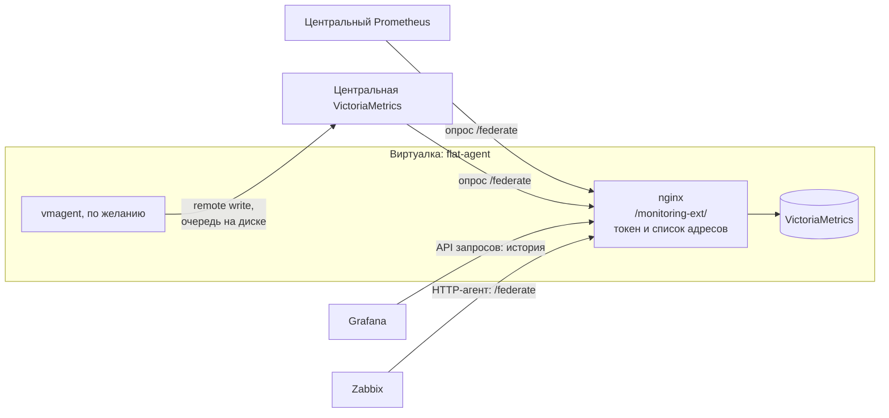

# 05 — Внешние системы

[← к оглавлению](../README.md)

flat_agent самодостаточен, но его данные можно забирать внешними системами
по стандартам Prometheus — как у MikroTik: смотреть локально или снимать
Prometheus или Zabbix.



Два способа:

- **Забирать (pull).** Внешняя система сама опрашивает виртуалку. Ничего
  не нужно включать на виртуалке, кроме доступа в nginx. Это основной способ.
- **Отправлять (push).** На виртуалке включается vmagent, он сам пишет данные
  в центр и копит их на диске, пока центр недоступен. Нужен, если центр не
  может достучаться до виртуалок (NAT, файрвол) или важно не терять данные
  при обрывах связи.

## Доступ для внешних систем

Внешние системы ходят на **`/monitoring-ext/`**: только чтение, по токену
`Authorization: Bearer …` и списку разрешённых адресов. Открыты только:

| Путь | Зачем |
|---|---|
| `/monitoring-ext/federate` | текущие значения в формате Prometheus: Prometheus, VictoriaMetrics, Zabbix |
| `/monitoring-ext/api/v1/query`, `query_range` | запросы и история: Grafana |
| `/monitoring-ext/api/v1/series`, `labels`, `label/<метка>/values`, `metadata` | автодополнение и фильтры: Grafana |
| `/monitoring-ext/api/v1/status/buildinfo` | Grafana определяет тип источника |

Всё остальное — 403. Конфигурация nginx — в
[01 — Архитектура](01-architecture.md#доступ-и-безопасность); проверена на
nginx 1.24.

## Центральный Prometheus или VictoriaMetrics: опрос `/federate`

Проверено на прототипе: центральная VictoriaMetrics забирала данные через
nginx с токеном, метки `host`, `job`, `product`, `package` сохранились.

```yaml
# prometheus.yml центральной системы (подходит и для VictoriaMetrics -promscrape.config).
scrape_configs:
  - job_name: flat-agent-federate
    scrape_interval: 30s
    honor_labels: true                 # сохранить host, job, instance, product, package с виртуалки
    scheme: https
    metrics_path: /monitoring-ext/federate
    params:
      "match[]": ['{host!=""}']        # всё, что собрала виртуалка
    authorization:
      credentials: CHANGE_ME           # уйдёт как Authorization: Bearer CHANGE_ME
    static_configs:
      - targets: ["ss-n1.example.local:443", "ss-n2.example.local:443"]
        labels: {stand: "prod"}
```

- **`honor_labels: true`** обязателен. Иначе центр перезапишет `job` и
  `instance` своими, и разные источники одной виртуалки смешаются.
- **`host`** приходит с виртуалки (`external_labels`), поэтому виртуалки не
  путаются между собой.
- **`match[]`** можно сузить, например
  `{__name__=~"up|probe_success|flat_.*|ALERTS"}` — только статусы и проблемы
  без метрик хоста.
- `/federate` отдаёт **последние значения** на момент опроса. Если центр
  был недоступен, история за это время у него будет с пропуском. Полная
  история остаётся на виртуалке. Если пропуски недопустимы — push через
  vmagent (ниже).

## Grafana

Источник данных типа **Prometheus**:

| Поле | Значение |
|---|---|
| URL | `https://ss-n1.example.local/monitoring-ext` |
| Custom HTTP Headers | `Authorization: Bearer CHANGE_ME` |
| HTTP Method | `POST` |

Grafana читает историю прямо с виртуалки, копировать данные в центр не нужно.
Для метрик `node_exporter` подходят готовые дашборды, например
«Node Exporter Full» (ID 1860).

Лицензия Grafana — **AGPL-3.0**, а не Apache-2.0. Это внешняя система
заказчика, в пакет flat-agent она не входит (см.
[07 — Лицензии](07-licenses.md#что-не-используем)).

## Zabbix

Zabbix умеет разбирать формат Prometheus:

- элемент данных типа **HTTP-агент** на
  `https://ss-n1.example.local/monitoring-ext/federate?match[]=…` с заголовком
  `Authorization: Bearer …`;
- зависимые элементы с предобработкой **«Prometheus pattern»** — по одному на
  метрику и метки, например `probe_success{check="api",package="fss-backend"}`;
- для списков (пакеты, файловые системы) — низкоуровневое обнаружение с
  предобработкой **«Prometheus to JSON»**.

Для метрик хоста у Zabbix есть готовый шаблон «Linux by Prom» — он рассчитан
на выдачу `node_exporter`. Через `/federate` приходят те же имена метрик, но с
дополнительными метками и таймстемпами. **Совместимость шаблона с
`/federate` нужно проверить на стенде**; если потребуется, для Zabbix
открывается выдача самого `node_exporter` отдельным путём в `/monitoring-ext/`.

## Отправка в центр: vmagent

Проверено на прототипе: пока центр был недоступен, vmagent копил данные и
отправил их после его появления; метки `host` и `stand` дошли.

На виртуалке:

1. в `/etc/flat-agent/flat-agent.env` задать адрес центра
   `FLAT_PUSH_URL=https://central.example.local/api/v1/write` и
   `FLAT_VM_SCRAPE_CONFIG=` (пусто: VictoriaMetrics перестаёт опрашивать
   экспортеры сама, их опрашивает vmagent);
2. `systemctl restart flat-agent-vm` и
   `systemctl enable --now flat-agent-vmagent`;
3. vmagent пишет в два адреса — локальную базу и центр, у каждого своя
   очередь на диске.

Флаги vmagent (проверены на прототипе; в пакете они уже в
`flat-agent-vmagent.service`, адрес центра — из `FLAT_PUSH_URL`, см.
[06 — Сборка и пакет](06-packaging.md#systemd)):

```text
/opt/flat/flat-agent/bin/vmagent \
  -httpListenAddr=127.0.0.1:8429 \
  -promscrape.config=/etc/flat-agent/scrape.yml \
  -promscrape.configCheckInterval=30s \
  -remoteWrite.url=http://127.0.0.1:8428/monitoring/api/v1/write \
  -remoteWrite.url=https://central.example.local/api/v1/write \
  -remoteWrite.tmpDataPath=/var/lib/flat-agent/vmagent \
  -remoteWrite.maxDiskUsagePerURL=500MB \
  -remoteWrite.label=stand=prod
```

- **`-remoteWrite.maxDiskUsagePerURL`** — предел очереди на адрес; при
  переполнении отбрасываются самые старые данные. По документации
  VictoriaMetrics минимум — 500 МБ на адрес. Для расчёта: скорость отправки ×
  допустимая длительность обрыва.
- **Авторизация в центре:** `-remoteWrite.bearerToken` или
  `-remoteWrite.basicAuth.*`. Адреса remote write vmagent по умолчанию
  маскирует в логах и на `/metrics`.
- **Протокол:** с VictoriaMetrics vmagent сам выбирает собственный протокол
  (трафик в 2–5 раз меньше), с Prometheus и другими приёмниками — Prometheus
  remote write 1.0.
- Центр должен принимать remote write: VictoriaMetrics принимает всегда,
  Prometheus — с флагом `--web.enable-remote-write-receiver`.

## Выгрузка истории

Для разбора инцидентов поддержка может выгрузить историю с виртуалки
целиком. Выполняется **на самой виртуалке** (снаружи эти пути закрыты):

```sh
# Всё за сутки в JSON Lines (читается человеком, импортируется обратно)
curl -s http://127.0.0.1:8428/monitoring/api/v1/export \
  -d 'match[]={__name__!=""}' -d 'start=-1d' > flat-agent-export.jsonl

# Загрузить в другую VictoriaMetrics
curl -X POST http://<другая-vm>:8428/api/v1/import -T flat-agent-export.jsonl
```

Для больших объёмов есть `/api/v1/export/native`: быстрее и компактнее, но
формат может меняться между версиями VictoriaMetrics.

## Чек-лист подключения внешней системы

1. Выдать токен и внести адрес системы в `allow` на виртуалке.
2. Проверить с адреса системы:
   `curl -H 'Authorization: Bearer …' https://<виртуалка>/monitoring-ext/api/v1/query?query=up`.
3. Настроить опрос `/federate` или источник данных Grafana.
4. Проверить в системе, что у рядов есть метка `host` нужной виртуалки.
