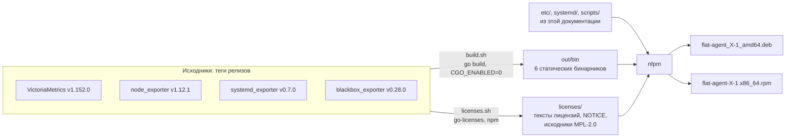

# 06 — Сборка и пакет

[← к оглавлению](../README.md)

flat_agent ставится **одним пакетом** `flat-agent` (deb и rpm). В нём уже есть
всё: VictoriaMetrics, vmalert, vmagent, экспортеры, базовая конфигурация, юниты
systemd и лицензии. На виртуалке не нужны Go, интернет и отдельная установка
экспортеров.

## Что проверено

Проверено 2026-09-25 на Ubuntu 24.04, Go 1.27.1:

- сборка всех программ из тегов релизов скриптом [`build.sh`](#buildsh):
  статические бинарники без CGO, версия видна в `--version`;
- сборка под arm64 той же командой (запуск на arm64 не проверялся);
- в бинарники записан коммит исходников и признак `vcs.modified=false`:
  собраны из неизменённого кода тега;
- deb и rpm собираются nfpm из одного описания; deb ставится, обновляется
  поверх предыдущей версии, удаляется и вычищается (`purge`);
- юниты проходят `systemd-analyze verify` (systemd 255);
- [`flat-agent-check`](#проверка-конфигурации) находит повторяющийся
  `job_name`, ошибку в правиле, ошибку в `blackbox.yml`, пустой `FLAT_HOST`.

Не проверено:

- работа юнитов под запущенным systemd (в песочнице systemd не работает):
  подстановка переменных, ограничения `Protect*`, чтение D-Bus
  `systemd_exporter`;
- установка rpm (проверены состав пакета, каталоги, конфиги и скрипты);
- Astra Linux, РЕД ОС, ALT Linux.

## Как собирается пакет



## Версии

| Компонент | Тег | Коммит | Дата коммита | Бинарники | Размер, МБ |
|---|---|---|---|---|---|
| VictoriaMetrics | `v1.152.0` | `540b91da03` | 2026-09-11 | `victoria-metrics`, `vmalert`, `vmagent` | 18,7; 18,1; 14,7 |
| node_exporter | `v1.12.1` | `6044da7835` | 2026-07-14 | `node_exporter` | 17,2 |
| systemd_exporter | `v0.7.0` | `8b490c0159` | 2025-03-14 | `systemd_exporter` | 14,2 |
| blackbox_exporter | `v0.28.0` | `5a059bee8d` | 2025-12-04 | `blackbox_exporter` | 24,1 |
| Go | 1.27.1 | — | — | компилятор, в пакет не входит | — |

- Коммит — тот, на который указывает тег (для аннотированных тегов —
  `git ls-remote … 'refs/tags/<тег>^{}'`).
- Всего бинарников — 107 МБ. Пакет со сжатием xz — 38 МБ, на диске после
  установки — 109 МБ (здесь и далее 1 МБ = 10⁶ байт).
- Прототип из документов 01–05 собирался из основных веток на 2026-09-24.
  Пакет собирается **только из тегов релизов**.

## Сборка

### build.sh

Проверен: сборка всех шести программ занимает около минуты.

```sh
#!/bin/sh
# build.sh — сборка бинарников flat-agent из тегов релизов (статически, без CGO).
set -eu

VM_TAG=v1.152.0            # VictoriaMetrics: victoria-metrics, vmalert, vmagent
NODE_TAG=v1.12.1           # node_exporter
SYSTEMD_TAG=v0.7.0         # systemd_exporter
BLACKBOX_TAG=v0.28.0       # blackbox_exporter

SRC=${SRC:-$PWD/src}
OUT=${OUT:-$PWD/out/bin}
export CGO_ENABLED=0 GOOS=linux GOARCH="${GOARCH:-amd64}"
mkdir -p "$SRC" "$OUT"

fetch() {  # <репозиторий> <тег> -> каталог исходников
  dir="$SRC/$(basename "$1")"
  [ -d "$dir" ] || git clone --quiet --depth 1 --branch "$2" "https://github.com/$1.git" "$dir"
  echo "$dir"
}

# VictoriaMetrics: три программы из одного репозитория, зависимости в vendor/.
dir=$(fetch VictoriaMetrics/VictoriaMetrics "$VM_TAG")
for app in victoria-metrics vmalert vmagent; do
  (cd "$dir" && go build -mod=vendor -trimpath \
    -ldflags "-s -w -X github.com/VictoriaMetrics/VictoriaMetrics/lib/buildinfo.Version=$app-$(date -u +%Y%m%d-%H%M%S)-$VM_TAG" \
    -o "$OUT/$app" "./app/$app")
done

# Экспортеры Prometheus: версия задаётся так же, как в их официальной сборке (promu).
prom() {  # <репозиторий> <тег> <бинарник>
  dir=$(fetch "$1" "$2")
  v=github.com/prometheus/common/version
  (cd "$dir" && go build -trimpath -ldflags "-s -w \
    -X $v.Version=${2#v} -X $v.Revision=$(git -C "$dir" rev-parse HEAD) -X $v.Branch=HEAD \
    -X $v.BuildUser=flat-agent-build -X $v.BuildDate=$(date -u +%Y%m%d-%H:%M:%S)" \
    -o "$OUT/$3" .)
}
prom prometheus/node_exporter "$NODE_TAG" node_exporter
prom prometheus-community/systemd_exporter "$SYSTEMD_TAG" systemd_exporter
prom prometheus/blackbox_exporter "$BLACKBOX_TAG" blackbox_exporter

ls -l "$OUT"
```

Почему так:

- **`CGO_ENABLED=0`** — чистый Go, статические бинарники без зависимости от
  glibc. Работают на любом Linux x86-64 (`GOAMD64=v1`), в том числе на
  старых дистрибутивах.
- **VictoriaMetrics без CGO** — это её официальный вариант `pure`
  (`make victoria-metrics-pure`). Обычные релизы VictoriaMetrics собираются с
  CGO: сжатие zstd в них — библиотека на C. В варианте `pure` zstd на Go
  (`github.com/klauspost/compress`): формат хранения тот же, сжатие немного
  медленнее, для сотен рядов разницы нет. Плюс — в пакете нет кода на C.
- **`-trimpath`, `-s -w`** — в бинарниках нет путей сборочной машины и
  отладочных символов.
- **`-mod=vendor`** — все зависимости VictoriaMetrics лежат в её репозитории
  (`vendor/`), при сборке ничего не скачивается.
- **Версия** задаётся теми же флагами `-X`, что в официальной сборке
  (`Makefile` VictoriaMetrics, `.promu.yml` экспортеров).

Проверка результата:

```sh
out/bin/victoria-metrics -version   # victoria-metrics-20260925-122318-v1.152.0
out/bin/node_exporter --version     # node_exporter, version 1.12.1 (branch: HEAD, revision: 6044da78…)
go version -m out/bin/node_exporter # версия Go, все модули с версиями, vcs.revision, vcs.modified=false
```

### Сборка без интернета

Для сборочного контура без доступа к GitHub:

- **Go** — дистрибутив во внутреннем хранилище. Если `go.dev` недоступен,
  тот же дистрибутив есть на `proxy.golang.org` как модуль
  `golang.org/toolchain` (так ставился Go в прототипе).
- **VictoriaMetrics** — зависимости уже в `vendor/`, достаточно зеркала
  репозитория.
- **Экспортеры** — один раз с доступом в интернет выполнить `go mod vendor`
  и положить исходники вместе с `vendor/` во внутренний git; собирать с
  `-mod=vendor`. Другой вариант — внутренний прокси модулей Go (Athens,
  Nexus, Artifactory) через `GOPROXY`.
- Архивы исходников тегов и `vendor/` хранятся у нас: сборку можно повторить,
  даже если исходный репозиторий станет недоступен (см.
  [07 — Лицензии](07-licenses.md#рф)).

### Другие архитектуры

`GOARCH=arm64 ./build.sh` собирает те же шесть программ под arm64
(проверено). В `nfpm.yaml` для такого пакета — `arch: arm64`.

### Лицензии

После `build.sh` запускается `licenses.sh` (текст и пояснения — в
[07 — Лицензии](07-licenses.md#проверка-лицензий)). Он кладёт в `licenses/`
тексты лицензий, файлы NOTICE, исходники модулей MPL-2.0 и лицензии
JS-библиотек встроенного VMUI, собирает `THIRD_PARTY.csv` и останавливает
сборку, если у зависимости лицензия не из списка разрешённых.

## Состав пакета

| Путь | Что | Тип |
|---|---|---|
| `/opt/flat/flat-agent/bin/` | `victoria-metrics`, `vmalert`, `vmagent`, `node_exporter`, `systemd_exporter`, `blackbox_exporter`, `flat-agent-check` | программы |
| `/etc/flat-agent/scrape.yml` | базовый сбор ([01](01-architecture.md#сбор-метрик)) | конфиг |
| `/etc/flat-agent/blackbox.yml` | модули проб `blackbox_exporter` (ниже) | конфиг |
| `/etc/flat-agent/rules.d/00-flat-base.yml` | базовые правила ([03](03-alerts.md)) | конфиг |
| `/etc/flat-agent/dashboards/00-flat-host.json` | дашборд хоста для VMUI ([04](04-frontend-api.md)) | конфиг |
| `/etc/flat-agent/scrape.d/`, `catalog.d/` | для файлов продуктов | каталог |
| `/etc/flat-agent/flat-agent.env` | общие настройки; создаёт `postinst`, в пакет не входит | — |
| `/usr/lib/systemd/system/flat-agent*` | target и юниты ([ниже](#systemd)) | юниты |
| `/usr/share/doc/flat-agent/` | `NOTICE`, `THIRD_PARTY.csv`, `licenses/` ([07](07-licenses.md)) | документация |
| `/var/lib/flat-agent/` | история (`vm/`), `textfile/`, очередь vmagent (`vmagent/`); создаёт `postinst` | данные |

Зависимостей у пакета нет: бинарники статические. nginx — у продукта.

`/etc/flat-agent/blackbox.yml`:

```yaml
modules:
  http_2xx:
    prober: http
    timeout: 5s
  tcp_connect:
    prober: tcp
    timeout: 3s
```

## nfpm.yaml

Пакеты собирает [nfpm](https://github.com/goreleaser/nfpm) (проверено на
v2.47.0, лицензия MIT; в пакет не входит):

```sh
VERSION=0.1.0 nfpm pkg --config nfpm.yaml --packager deb --target dist/
VERSION=0.1.0 nfpm pkg --config nfpm.yaml --packager rpm --target dist/
```

```yaml
# nfpm.yaml — пакет flat-agent: deb и rpm из одного описания.
# VERSION=0.1.0 nfpm pkg --packager deb --target out/   (и --packager rpm)
name: flat-agent
arch: amd64
platform: linux
version: ${VERSION}
release: 1
section: admin
priority: optional
maintainer: "FLAT <support@example.invalid>"
vendor: FLAT
description: |
  Local mini-monitoring for FLAT products: VictoriaMetrics single-node,
  vmalert, vmagent, node_exporter, systemd_exporter, blackbox_exporter.
license: "Proprietary; bundles Apache-2.0, MIT, BSD-2-Clause, BSD-3-Clause, MPL-2.0 components"

contents:
  # Бинарники (build.sh) и скрипт проверки конфигурации.
  - src: ./out/bin/*
    dst: /opt/flat/flat-agent/bin/
  - src: ./scripts/flat-agent-check
    dst: /opt/flat/flat-agent/bin/flat-agent-check
    file_info: {mode: 0755}

  # Базовая конфигурация: правки администратора при обновлении не затираются.
  - src: ./etc/scrape.yml
    dst: /etc/flat-agent/scrape.yml
    type: config|noreplace
  - src: ./etc/blackbox.yml
    dst: /etc/flat-agent/blackbox.yml
    type: config|noreplace
  - src: ./etc/rules.d/00-flat-base.yml
    dst: /etc/flat-agent/rules.d/00-flat-base.yml
    type: config|noreplace
  - src: ./etc/dashboards/00-flat-host.json
    dst: /etc/flat-agent/dashboards/00-flat-host.json
    type: config|noreplace

  # Каталоги пакета; scrape.d и catalog.d — для файлов продуктов.
  - dst: /opt/flat/flat-agent
    type: dir
  - dst: /opt/flat/flat-agent/bin
    type: dir
  - dst: /etc/flat-agent
    type: dir
  - dst: /etc/flat-agent/scrape.d
    type: dir
  - dst: /etc/flat-agent/rules.d
    type: dir
  - dst: /etc/flat-agent/dashboards
    type: dir
  - dst: /etc/flat-agent/catalog.d
    type: dir
  - dst: /usr/share/doc/flat-agent
    type: dir

  # systemd: /usr/lib/systemd/system есть в пути поиска юнитов на всех целевых ОС.
  - src: ./systemd/*
    dst: /usr/lib/systemd/system/

  # Лицензии, NOTICE, исходники модулей MPL-2.0, список зависимостей.
  - src: ./licenses
    dst: /usr/share/doc/flat-agent/licenses
    type: tree
  - src: ./NOTICE
    dst: /usr/share/doc/flat-agent/NOTICE
  - src: ./THIRD_PARTY.csv
    dst: /usr/share/doc/flat-agent/THIRD_PARTY.csv

scripts:
  postinstall: ./scripts/postinst.sh
  preremove: ./scripts/prerm.sh
  postremove: ./scripts/postrm.sh

deb:
  compression: xz
rpm:
  compression: xz
```

- **`config|noreplace`** — в deb это conffiles, в rpm — `%config(noreplace)`.
  Файл, который администратор не менял, при обновлении заменяется молча
  (проверено). Изменённый deb оставляет с вопросом (или без вопроса с
  `--force-confold`), rpm кладёт новый рядом как `.rpmnew`. Поэтому базовые
  файлы не правим: свои задания и правила — в `*.d/`, настройки — в
  `flat-agent.env`.
- **Юниты — в `/usr/lib/systemd/system`.** Этот каталог systemd читает на всех
  целевых ОС. Каталоги `/lib` и `/usr/lib` пакет своими не объявляет, поэтому
  не конфликтует с ОС, где `/lib` — ссылка на `/usr/lib`.
- **Каталоги объявлены явно** (`type: dir`): rpm удаляет их вместе с пакетом.

## systemd

| Юнит | Что | Когда работает |
|---|---|---|
| `flat-agent.target` | весь мониторинг | при загрузке (`multi-user.target`) |
| `flat-agent-vm.service` | VictoriaMetrics | вместе с target |
| `flat-agent-vmalert.service` | vmalert | вместе с target |
| `flat-agent-node-exporter.service` | node_exporter | вместе с target |
| `flat-agent-systemd-exporter.service` | systemd_exporter | вместе с target |
| `flat-agent-blackbox.service` | blackbox_exporter | вместе с target |
| `flat-agent-vmagent.service` | vmagent | только если включить |
| `flat-agent-exporter.service` | flat-exporter | план |

Управление:

```sh
systemctl status flat-agent.target
systemctl restart flat-agent.target         # перезапустить всё
systemctl restart flat-agent-vmalert        # один компонент
systemctl mask --now flat-agent-blackbox    # выключить компонент ядра
journalctl -u 'flat-agent*' --since -1h     # логи всех компонентов
```

Юниты (проверены `systemd-analyze verify`):

```ini
# /usr/lib/systemd/system/flat-agent.target
[Unit]
Description=flat-agent: local monitoring for FLAT products
Wants=flat-agent-vm.service flat-agent-vmalert.service flat-agent-node-exporter.service flat-agent-systemd-exporter.service flat-agent-blackbox.service

[Install]
WantedBy=multi-user.target
```

```ini
# /usr/lib/systemd/system/flat-agent-vm.service
[Unit]
Description=flat-agent: VictoriaMetrics single-node (history, API, VMUI)
PartOf=flat-agent.target
After=network.target

[Service]
User=flat-agent
Group=flat-agent
EnvironmentFile=/etc/flat-agent/flat-agent.env
ExecStart=/opt/flat/flat-agent/bin/victoria-metrics \
    -httpListenAddr=127.0.0.1:8428 \
    -http.pathPrefix=/monitoring \
    -http.disableCORS \
    -storageDataPath=/var/lib/flat-agent/vm \
    -retentionPeriod=${FLAT_RETENTION} \
    -storage.minFreeDiskSpaceBytes=${FLAT_MIN_FREE_DISK} \
    -memory.allowedBytes=${FLAT_VM_MEMORY} \
    -disablePerDayIndex \
    -promscrape.config=${FLAT_VM_SCRAPE_CONFIG} \
    -promscrape.configCheckInterval=30s \
    -vmui.customDashboardsPath=/etc/flat-agent/dashboards \
    -vmalert.proxyURL=http://127.0.0.1:8880 \
    -search.latencyOffset=10s
Restart=on-failure
RestartSec=5s
LimitNOFILE=65536
NoNewPrivileges=yes
ProtectSystem=strict
ProtectHome=yes
PrivateTmp=yes
ReadWritePaths=/var/lib/flat-agent/vm
```

```ini
# /usr/lib/systemd/system/flat-agent-vmalert.service
[Unit]
Description=flat-agent: vmalert (rules and alerts)
PartOf=flat-agent.target
After=network.target flat-agent-vm.service

[Service]
User=flat-agent
Group=flat-agent
EnvironmentFile=/etc/flat-agent/flat-agent.env
ExecStart=/opt/flat/flat-agent/bin/vmalert \
    -httpListenAddr=127.0.0.1:8880 \
    -rule=/etc/flat-agent/rules.d/*.yml \
    -configCheckInterval=30s \
    -datasource.url=http://127.0.0.1:8428/monitoring \
    -remoteWrite.url=http://127.0.0.1:8428/monitoring \
    -remoteRead.url=http://127.0.0.1:8428/monitoring \
    -evaluationInterval=15s \
    -rule.evalDelay=10s \
    -external.url=https://${FLAT_EXTERNAL_HOST}/monitoring \
    -notifier.blackhole
Restart=on-failure
RestartSec=5s
NoNewPrivileges=yes
ProtectSystem=strict
ProtectHome=yes
PrivateTmp=yes
```

```ini
# /usr/lib/systemd/system/flat-agent-node-exporter.service
[Unit]
Description=flat-agent: node_exporter (host metrics)
PartOf=flat-agent.target
After=network.target

[Service]
User=flat-agent
Group=flat-agent
ExecStart=/opt/flat/flat-agent/bin/node_exporter \
    --web.listen-address=127.0.0.1:9100 \
    --collector.textfile.directory=/var/lib/flat-agent/textfile
Restart=on-failure
RestartSec=5s
NoNewPrivileges=yes
ProtectSystem=strict
ProtectHome=read-only
```

```ini
# /usr/lib/systemd/system/flat-agent-systemd-exporter.service
[Unit]
Description=flat-agent: systemd_exporter (unit state and resources)
PartOf=flat-agent.target
After=network.target

[Service]
User=flat-agent
Group=flat-agent
EnvironmentFile=/etc/flat-agent/flat-agent.env
ExecStart=/opt/flat/flat-agent/bin/systemd_exporter \
    --web.listen-address=127.0.0.1:9558 \
    --systemd.collector.unit-include=${FLAT_SYSTEMD_UNITS} \
    --systemd.collector.enable-restart-count
Restart=on-failure
RestartSec=5s
NoNewPrivileges=yes
ProtectSystem=strict
ProtectHome=yes
PrivateTmp=yes
```

```ini
# /usr/lib/systemd/system/flat-agent-blackbox.service
[Unit]
Description=flat-agent: blackbox_exporter (HTTP and TCP probes)
PartOf=flat-agent.target
After=network.target

[Service]
User=flat-agent
Group=flat-agent
ExecStart=/opt/flat/flat-agent/bin/blackbox_exporter \
    --web.listen-address=127.0.0.1:9115 \
    --config.file=/etc/flat-agent/blackbox.yml
ExecReload=/bin/kill -HUP $MAINPID
Restart=on-failure
RestartSec=5s
NoNewPrivileges=yes
ProtectSystem=strict
ProtectHome=yes
PrivateTmp=yes
```

```ini
# /usr/lib/systemd/system/flat-agent-vmagent.service
[Unit]
Description=flat-agent: vmagent (push to central storage with disk queue)
PartOf=flat-agent.target
After=network-online.target flat-agent-vm.service
Wants=network-online.target

[Service]
User=flat-agent
Group=flat-agent
EnvironmentFile=/etc/flat-agent/flat-agent.env
ExecStart=/opt/flat/flat-agent/bin/vmagent \
    -httpListenAddr=127.0.0.1:8429 \
    -promscrape.config=/etc/flat-agent/scrape.yml \
    -promscrape.configCheckInterval=30s \
    -remoteWrite.url=http://127.0.0.1:8428/monitoring/api/v1/write \
    -remoteWrite.url=${FLAT_PUSH_URL} \
    -remoteWrite.tmpDataPath=/var/lib/flat-agent/vmagent \
    -remoteWrite.maxDiskUsagePerURL=500MB
Restart=on-failure
RestartSec=5s
NoNewPrivileges=yes
ProtectSystem=strict
ProtectHome=yes
PrivateTmp=yes
ReadWritePaths=/var/lib/flat-agent/vmagent

[Install]
WantedBy=flat-agent.target
```

Как это работает:

- **Один target на всё.** `flat-agent.target` запускает компоненты ядра через
  `Wants=`. У каждого сервиса `PartOf=flat-agent.target`: остановка и
  перезапуск target действуют на все компоненты.
- **Настройки — из `flat-agent.env`.** systemd подставляет `${…}` в
  `ExecStart`. После изменения файла нужен
  `systemctl restart flat-agent.target`.
- **Ограничения.** Процессы работают от пользователя `flat-agent`, без новых
  привилегий, файловая система для них только на чтение, кроме своего
  каталога данных (`ReadWritePaths`). У `node_exporter` вместо
  `ProtectHome=yes` стоит `read-only`: иначе вместо `/home` он увидит пустой
  каталог и неверно покажет место на этом разделе. На стенде проверить
  `systemd-analyze security flat-agent-vm.service` и что все метрики на месте;
  ограничения можно усиливать после такой проверки.
- **`FLAT_SYSTEMD_UNITS`** — регулярное выражение для
  `--systemd.collector.unit-include`; `systemd_exporter` сам окружает его
  `^(?:…)$`. По умолчанию `.+[.]service` — все сервисы. Когда появится
  `catalog.d/`, выражение собирается из имён пакетов, их старых имён и
  зависимостей, например `(fss-backend|fss-server|nginx|postgresql.*)[.]service`.
  Точка записана как `[.]`, а не `\.`: так не нужно думать об экранировании
  ни в файле systemd, ни в shell.
- **Отправка в центр (по желанию).** В `flat-agent.env` задать
  `FLAT_VM_SCRAPE_CONFIG=` (пусто — VictoriaMetrics перестаёт опрашивать сама)
  и `FLAT_PUSH_URL=https://<центр>/api/v1/write`, затем
  `systemctl restart flat-agent-vm` и
  `systemctl enable --now flat-agent-vmagent`. Подробности —
  [05 — Внешние системы](05-integrations.md#отправка-в-центр-vmagent).
- **MVP flat-exporter** (план): скрипт раз в минуту по таймеру systemd пишет
  `/var/lib/flat-agent/textfile/flat.prom`. Запись атомарная: во временный
  файл в том же каталоге, затем `mv` — иначе `node_exporter` может прочитать
  файл наполовину.

## Скрипты пакета

| Действие | deb | rpm | Что происходит |
|---|---|---|---|
| Установка | `apt install ./flat-agent_….deb` | `dnf install ./flat-agent-….rpm` | пользователь, каталоги, `flat-agent.env`, проверка, запуск |
| Обновление | то же с новой версией | то же с новой версией | конфиги по правилам `config`, проверка, перезапуск |
| Удаление | `apt remove flat-agent` | `dnf remove flat-agent` | остановка; история и настройки остаются |
| Полное удаление | `apt purge flat-agent` | — | удаляются история, `flat-agent.env`, пользователь |

В rpm нет полного удаления: после `dnf remove` каталог `/var/lib/flat-agent`
и `flat-agent.env` удаляют вручную.

`postinst.sh`:

```sh
#!/bin/sh
# flat-agent postinst (deb и rpm): пользователь, каталоги, настройки, проверка, запуск.
set -e

# 1. Системный пользователь без входа в систему.
getent group flat-agent >/dev/null || groupadd --system flat-agent
getent passwd flat-agent >/dev/null || useradd --system --gid flat-agent \
    --home-dir /var/lib/flat-agent --no-create-home \
    --shell "$(command -v nologin || echo /bin/false)" flat-agent

# 2. Каталоги данных.
install -d -m 0755 -o flat-agent -g flat-agent /var/lib/flat-agent \
    /var/lib/flat-agent/vm /var/lib/flat-agent/textfile /var/lib/flat-agent/vmagent

# 3. Настройки создаются один раз, дальше их правит администратор.
ENV_FILE=/etc/flat-agent/flat-agent.env
if [ ! -e "$ENV_FILE" ]; then
    cat > "$ENV_FILE" <<EOF
# flat-agent: общие настройки. Комментарии — только отдельной строкой.
# Метка host на всех рядах.
FLAT_HOST=$(hostname -s)
# Срок хранения истории.
FLAT_RETENTION=30d
# Предел кешей VictoriaMetrics.
FLAT_VM_MEMORY=256MiB
# Если свободного места меньше, база перестаёт принимать данные.
FLAT_MIN_FREE_DISK=1GB
# Адрес виртуалки для ссылок из алертов.
FLAT_EXTERNAL_HOST=$(hostname -f 2>/dev/null || hostname)
# Какие юниты собирает systemd_exporter (регулярное выражение).
FLAT_SYSTEMD_UNITS='.+[.]service'
# Кто опрашивает экспортеры: VictoriaMetrics (по умолчанию) или vmagent (пусто).
FLAT_VM_SCRAPE_CONFIG=/etc/flat-agent/scrape.yml
# Куда vmagent отправляет данные (только если включён flat-agent-vmagent).
FLAT_PUSH_URL=
EOF
    chmod 0644 "$ENV_FILE"
fi

# 4. Проверка всей конфигурации, включая файлы продуктов.
/opt/flat/flat-agent/bin/flat-agent-check

# 5. Запуск; при обновлении — перезапуск на новых бинарниках.
if [ -d /run/systemd/system ]; then
    systemctl daemon-reload
    systemctl enable flat-agent.target >/dev/null 2>&1
    systemctl restart flat-agent.target
fi
```

`prerm.sh`:

```sh
#!/bin/sh
# flat-agent prerm: при удалении — остановить и убрать из автозапуска; при обновлении — ничего.
set -e
case "$1" in
    remove|0)   # deb: remove; rpm: 0 — удаляется последняя версия
        if [ -d /run/systemd/system ]; then
            systemctl disable --now flat-agent.target flat-agent-vmagent.service >/dev/null 2>&1 || true
        fi
        ;;
esac
```

`postrm.sh`:

```sh
#!/bin/sh
# flat-agent postrm: purge (только deb) удаляет историю, настройки и пользователя.
set -e
if [ "$1" = purge ]; then
    rm -rf /var/lib/flat-agent
    rm -f /etc/flat-agent/flat-agent.env
    userdel flat-agent >/dev/null 2>&1 || true
    groupdel flat-agent >/dev/null 2>&1 || true
fi
if [ -d /run/systemd/system ]; then
    systemctl daemon-reload || true
fi
```

- Скрипты общие для deb и rpm: nfpm передаёт им аргументы менеджера пакетов
  (`configure`, `remove`, `purge` в deb; число оставшихся версий в rpm).
- Если `flat-agent-check` находит ошибку, `postinst` завершается с ошибкой
  **до перезапуска**: работающие процессы остаются на старой версии, пакет
  помечается как не настроенный. После исправления —
  `dpkg --configure -a` (deb).
- `useradd` и `groupadd` — из shadow-utils, стандартные для Debian- и
  RHEL-подобных ОС; на ALT Linux проверить (см.
  [«Особенности ОС»](#особенности-ос)).

## Проверка конфигурации

`/opt/flat/flat-agent/bin/flat-agent-check` проверяет конфигурацию целиком:
базовые файлы и файлы всех продуктов.

```sh
#!/bin/sh
# flat-agent-check — проверка конфигурации flat-agent вместе с файлами продуктов.
# 0 — всё корректно; иначе ошибка выводится, ничего не применяется.
set -eu
BIN=/opt/flat/flat-agent/bin
CONF=/etc/flat-agent

set -a
. "$CONF/flat-agent.env"
set +a
# VictoriaMetrics не считает незаданную переменную ошибкой: в метке host останется "%{FLAT_HOST}".
: "${FLAT_HOST:?не задан в $CONF/flat-agent.env}"

"$BIN/victoria-metrics" -promscrape.config="$CONF/scrape.yml" -dryRun -loggerLevel=ERROR
"$BIN/vmalert" -rule="$CONF/rules.d/*.yml" -dryRun -loggerLevel=ERROR
"$BIN/blackbox_exporter" --config.file="$CONF/blackbox.yml" --config.check --log.level=error

# Один файл с ошибкой ломает вкладку Dashboards целиком, поэтому JSON тоже проверяем (если есть python3).
if command -v python3 >/dev/null 2>&1; then
    for f in "$CONF"/dashboards/*.json; do
        [ -e "$f" ] || continue
        python3 -m json.tool "$f" >/dev/null || { echo "ошибка JSON: $f" >&2; exit 1; }
    done
fi
echo "flat-agent-check: OK"
```

Что проверено на пакете:

| Ошибка | Результат |
|---|---|
| одинаковый `job_name` в двух файлах `scrape.d/` | код 255: ``duplicate `job_name` in `scrape_configs` … "softswitch-api"`` |
| ошибка в выражении правила | код 255: `invalid expression for rule "Bad"` |
| неизвестное поле в `blackbox.yml` | код 1: `field timeoutt not found` |
| незакрытая скобка в JSON дашборда | код 1: `ошибка JSON: /etc/flat-agent/dashboards/…` |
| пустой `FLAT_HOST` | код 2: `FLAT_HOST: не задан в /etc/flat-agent/flat-agent.env` |
| корректный файл продукта | код 0, `flat-agent-check: OK` |

Не проверяется:

- **JSON дашбордов без python3** на виртуалке. Один файл с ошибкой ломает
  вкладку Dashboards целиком: `/monitoring/vmui/custom-dashboards` отвечает
  400 для всех дашбордов (проверено). Поэтому JSON дашбордов проверяется ещё
  и в CI продукта.
- **Имя модуля `prober`** в `blackbox.yml`: опечатка всплывёт только при пробе
  (`probe_success=0` и ошибка в логе).
- **Флаги запуска.** Неизвестный флаг — фатальная ошибка при старте. При
  обновлении версий компонентов флаги проверяются на стенде (см.
  [«Обновление компонентов»](#обновление-компонентов)).

### Файлы продуктов

Сломанный файл сбора или правил опасен не сразу: работающие VictoriaMetrics
и vmalert при ошибке оставляют прежнюю конфигурацию и пишут ошибку в лог. Но
при следующем перезапуске (обновление, перезагрузка) они не стартуют, и
пропадает весь мониторинг виртуалки. Сломанный JSON дашборда ломает вкладку
Dashboards сразу. Поэтому продукт подключает свои файлы так: положить,
проверить, при ошибке убрать.

```sh
# postinst продукта (пример SoftSwitch): подключить мониторинг, не сломав его.
SRC=/usr/share/softswitch/flat-agent
if [ -x /opt/flat/flat-agent/bin/flat-agent-check ]; then
    install -m 0644 "$SRC/scrape.yml" /etc/flat-agent/scrape.d/softswitch.yml
    install -m 0644 "$SRC/rules.yml" /etc/flat-agent/rules.d/softswitch.yml
    install -m 0644 "$SRC/dashboard.json" /etc/flat-agent/dashboards/softswitch.json
    if ! /opt/flat/flat-agent/bin/flat-agent-check; then
        rm -f /etc/flat-agent/scrape.d/softswitch.yml /etc/flat-agent/rules.d/softswitch.yml \
              /etc/flat-agent/dashboards/softswitch.json
        echo "SoftSwitch: файлы мониторинга не приняты flat-agent, ошибка выше" >&2
    fi
fi
```

- Файлы продукт держит у себя (`/usr/share/<продукт>/flat-agent/`), а в
  `/etc/flat-agent/` копирует `postinst`. `postrm` продукта их удаляет.
- Ошибка в файлах мониторинга не мешает установке продукта: мониторинг
  продукта просто не подключается, об этом сообщение в выводе установки.
- В CI продукта те же файлы проверяются `flat-agent-check` в контейнере с
  пакетом `flat-agent` до выпуска.

## Проверка после установки

Проверено на прототипе:

```sh
/opt/flat/flat-agent/bin/flat-agent-check
systemctl is-active flat-agent.target

# Все источники опрашиваются: job=…, state=up
curl -s http://127.0.0.1:8428/monitoring/targets

# Нет недоступных источников: ожидается значение "0"
curl -s 'http://127.0.0.1:8428/monitoring/api/v1/query?query=count(up==0)%20or%20vector(0)'

# Правила загружены, у всех health "ok"
curl -s http://127.0.0.1:8428/monitoring/vmalert/api/v1/rules
```

## Особенности ОС

Всё ниже — список для проверки на стендах, на прототипе не проверялось.

| ОС | Что проверить |
|---|---|
| Astra Linux SE | При включённой замкнутой программной среде (ЗПС) запускаются только подписанные ELF-файлы: бинарники из пакета нужно подписать ключом, который есть в ЗПС (`bsign`), иначе они не запустятся. Работа при включённом мандатном контроле (МРД, МКЦ). |
| РЕД ОС | rpm; если SELinux в режиме `enforcing` — что сервисы стартуют и читают свои каталоги (при отказах — записи в `audit.log`). |
| ALT Linux | rpm; `useradd`, `groupadd` и путь к `nologin`. |
| Все | systemd 235 и новее — для `systemd_service_restart_total`. `/proc` с `hidepid=2`: flat-exporter (процессы и память пакетов) без членства в группе из опции `gid=` увидит не все процессы; `node_exporter` в нашей настройке и `systemd_exporter` чужие процессы в `/proc` не читают. |

## Обновление компонентов

VictoriaMetrics выпускает LTS-ветки только для Enterprise; в open source все
исправления, включая исправления безопасности, выходят в обычных релизах.
Поэтому обновляемся на последние релизы, раз в квартал и при уязвимостях.

1. Прочитать `CHANGELOG` каждого компонента: удалённые флаги,
   переименованные метрики, изменения API.
2. Поменять теги в `build.sh`, собрать.
3. Лицензии: `licenses.sh` и сравнить новый `THIRD_PARTY.csv` с прошлым
   (новые модули, новые лицензии; см.
   [07 — Лицензии](07-licenses.md#проверка-лицензий)).
4. Уязвимости: `govulncheck -mode=binary out/bin/<программа>`. Нужен доступ к
   `vuln.go.dev` или локальная копия базы (`-db file:///…`); в песочнице
   прототипа адрес закрыт, не проверялось.
5. Стенд: установить пакет поверх предыдущего, проверить, что все юниты
   запустились (флаги), `flat-agent-check`, модульные тесты правил
   (`vmalert-tool unittest`, см. [03 — Алерты](03-alerts.md)) и что имена
   метрик не изменились: сравнить списки
   `/monitoring/api/v1/label/__name__/values` до и после.
6. Поднять версию пакета, выпустить.

## Происхождение и состав (SBOM)

Состав каждого бинарника записан в нём самом:

```text
$ go version -m out/bin/victoria-metrics
out/bin/victoria-metrics: go1.27.1
        mod     github.com/VictoriaMetrics/VictoriaMetrics      v1.152.0
        dep     …                                              (все модули с версиями и хешами)
        build   -trimpath=true
        build   CGO_ENABLED=0
        build   GOARCH=amd64
        build   GOOS=linux
        build   GOAMD64=v1
        build   vcs.revision=540b91da031aa8b7d53d3784693bb451e2be980a
        build   vcs.modified=false
```

- `vcs.revision` совпадает с коммитом тега, `vcs.modified=false` — исходники
  не изменялись. Этого достаточно, чтобы ответить, из чего собран пакет.
- Список модулей и лицензий кладётся в пакет:
  `/usr/share/doc/flat-agent/THIRD_PARTY.csv`.
- Если нужен SBOM в стандартном формате (CycloneDX, SPDX), его строят из тех
  же данных, например `cyclonedx-gomod` (не проверялось).
